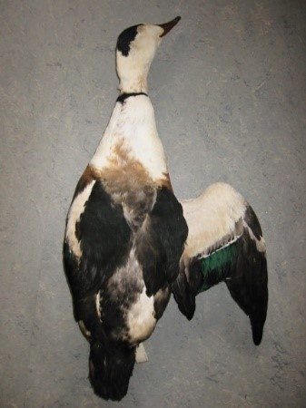
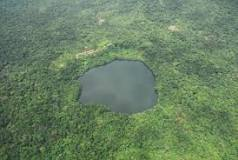
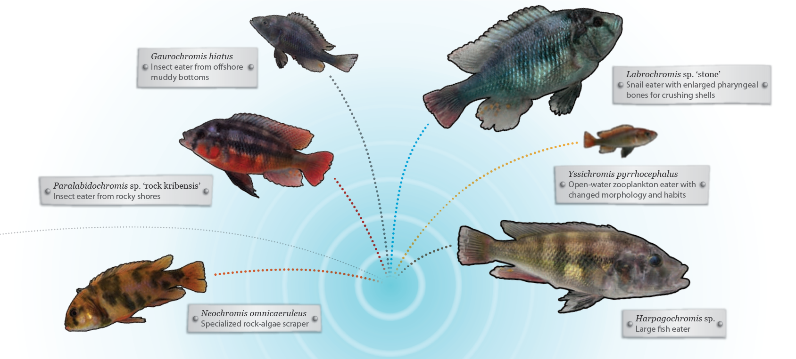
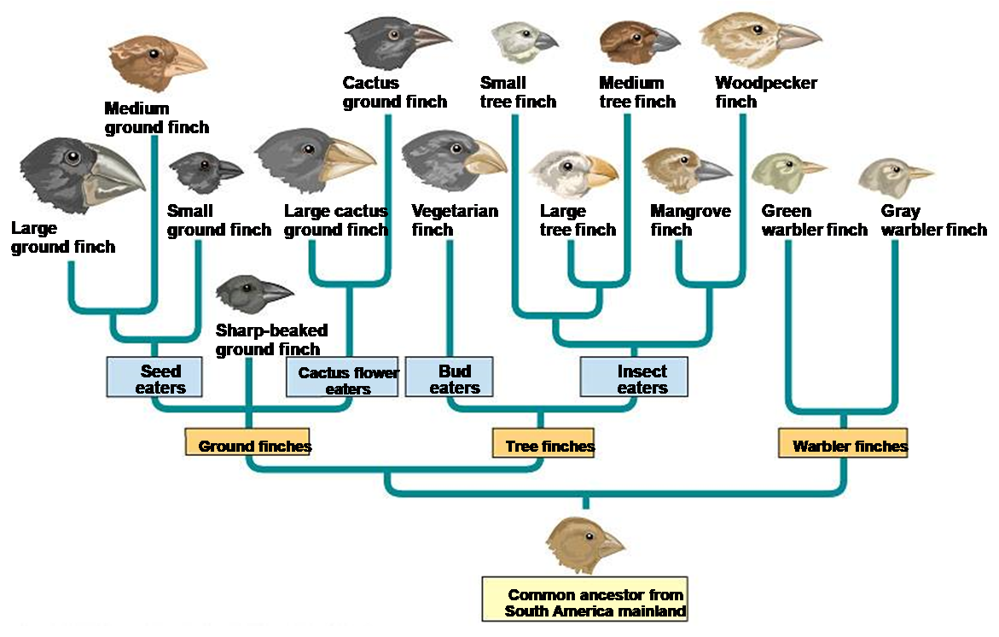
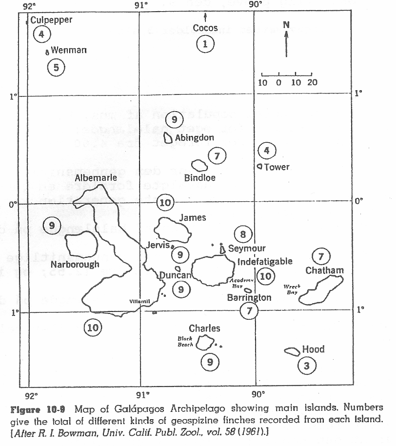
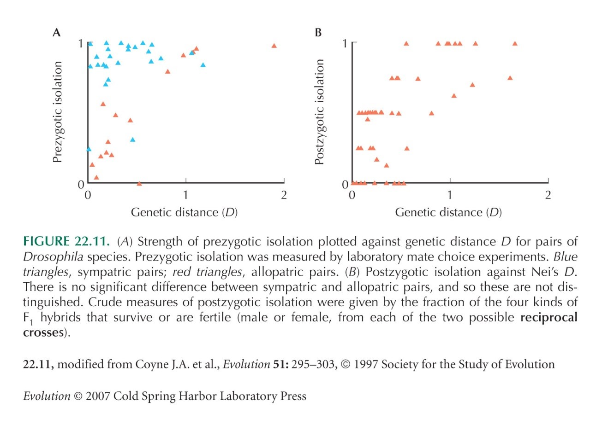
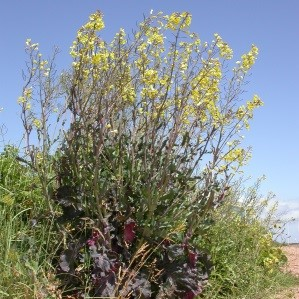
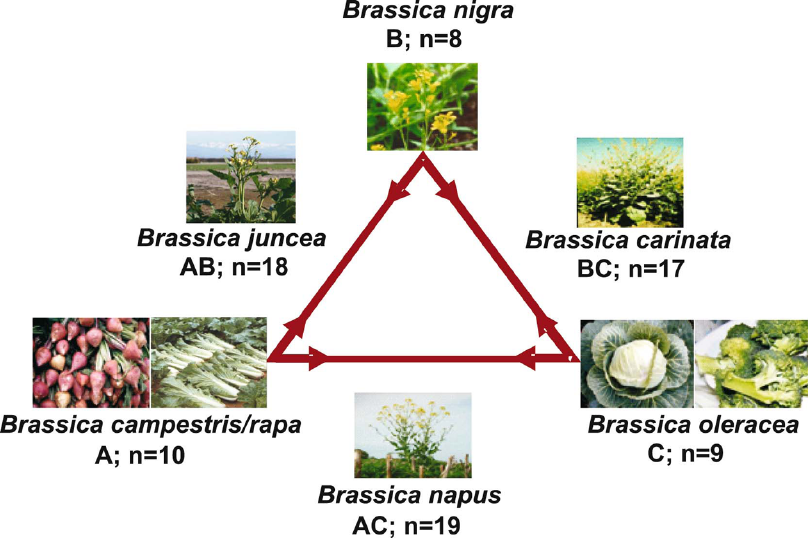

# Artsdannelse
###   Hans R. Siegismund
###  Baggrund

*Arter* er – ligesom genomer, celler og organismer – en fundamental enhed i biologien. Inden for eksperimentel biologi arbejdes der ofte med specifikke arter som for eksempel bakterien *Escherichia coli*, bananfluen *Drosphila melanogaster* eller musen *Mus musculus*. Når disse arter nævnes, er man sjældent i tvivl om hvilke arter, det drejer sig om. Der er meget ofte klart, hvilke organismer, der kan henføres til samme art. Nogle gange vil det være vanskeligt at afgrænse, hvordan man opdeler organismer i arter. Dette er ikke overraskende, da der til stadighed forgår evolution, og der derfor i nogle tilfælde vil være populationer, der er i færd med at differentieres fra hinanden til artsniveau.

<figure>
  
 </figure>
 
Der findes mange forskellige definitioner af arter, der hver især har fokus på specifikke egenskaber eller processer. Et vidt accepteret er det *biologiske artsbegreb*, som blev introduceret af Ernst Mayr i 1942. Ifølge det biologiske artsbegreb er en art en gruppe af populationer, der er reproduktivt adskilt fra andre grupper af populationer. Her fokuseres på *reproduktiv isolation*, der dog ikke behøver at være 100%. Mange arter hybridiserer i en vis grad, uden at de derved mister deres genetiske integritet. For eksempel, mange andefugle hybridiserer lejlighedsvis. Det kan dog nogle gange være svært at afgøre, hvilke to arter, der indgår som forældre til en hybrid. Hvem mon det kan have været i fuglen, som er afbildet?

### Formål

I øvelsen vil vi fokusere på

- Artsbegreber
- Barrierer til genspredning/reproduktiv isolation
- Artsdannelse

## 

### Opgave 1

Som nævnt ovenfor, så findes der mange artsbegreber. Her starter vi med
at tage udgangspunkt i tre forskellige:

 - *Dansk Flora*, Gyldendal, 2006, indledes med
  “Der er gennem årene gjort talrige forsøg på at definere arten, der er
den grundlæggende systematiske enhed. Imidlertid kendes langt
størstedelen af alle Jordens arter alene på variationen i ydre,
observerbare karaktertræk, dvs. på deres morfologi. *Arten defineres
derfor som en samling individer, der ligner hinanden i væsentlige
træk*.”

- I Lars Jonsson, 1994. *Fugle i Europa*. Gyldendal, defineres arten
 således: “Definitionen på en selvstændig art er traditionelt, at den er så
 genetisk anderledes, at den ikke kan avle reproduktionsdygtigt afkom
 med en anden art. ... I sjældne tilfælde kan hybrider mellem to
 ‘arter’ avle fertilt afkom inden for et begrænset geografisk område,
 fx Gråmåge × Sølvmåge på Island og Broget Fluesnapper × Hvidhalset
 Fluesnapper på Gotland (Sverige). Forskelle i stemme og opførsel
 betyder dog, at de alligevel betragtes som adskilte arter.”

- Groves, C., Grubb, P. *Ungulate Taxonomy*. Baltimore: John Hopkins
 University Press; 2011, definerer arten som“A species is the smallest population or aggregation of populations which has fixed heritable differences from other such populations or  aggregations”

1)  Hvilke artsbegreber er der her tale om?

Klik for at se svaret.

 1) Morfologisk/ fænetisk 
 2) Biologisk 
 3) Fylogenetisk

1)  Hvilke egenskaber eller processer fokuserer de tre artsbegreber på?

Klik for at se svaret.

1) Morfologi 
2) Reproduktiv isolation 
3) Diagnosticerbare forskelle

2)  Hvilket af disse tre artsbegreber vil splitte flest og hvilket vil
    samle flest arter?

Klik for at se svaret.

Det fylogenetiske artsbegreb vil splitte flest arter. Det morfologiske/fænetiske artsbegreb vil samle flest arter. 

3)  Hvilke data ville være ideelle, hvis man skal afgøre om en samling
    organismer tilhører én eller flere arter.

Klik for at se svaret.

Morfologi, økologi, udbredelse, molekylære data samt kendskab til reproduktiv isolation.

### Opgave 2

<figure>
  
 </figure>

Lake Bermin i Cameroun er en lille kratersø, mindre end en halv
kvadratkilometer stor. Søen er forholdsvis lav, det dybeste sted er 16
meter dyb. Den huser ni arter af *Tilapia*-cichlider, der har
specialiseret sig på forskellig vis. Nogle lever af plankton, andre af
detritus og andre igen af ferskvandssvampe. Undersøgelser af
DNA-sekvenser viste, at de alle ni var mere beslægtede med hinanden end
med cichlider fra andre søer i Cameroon (og andre lande).

1)  Hvilken artsdannelse må der være tale om, når man fokuserer på den
    geografiske komponent?

Klik for at se svaret.

Sympatrisk

2)  Er dette den form for artsdannelse, der accepteres som den mest
    almindeligt forekommende hos dyr? Begrund.

Klik for at se svaret.

Allopatrisk artsdannelse anses som den mest udbredte hos dyr.

3)  Hvilken isolationsmekanisme forventes at være mest vigtig til at
    opretholde arterne, præzygotisk eller postzygotisk? Begrund svaret.

Klik for at se svaret.

Præzygotiske

###   Opgave 3

I England har man undersøgt tre plantearter, I, II, og III i to
lokaliteter, A og B. Man har dels analyseret variationen i et nukleart
nedarvet gen og dels i et gen, placeret i kloroplasten, der nedarves
maternelt hos disse arter.

Hos det nukleare gen observeredes i alt 3 alleler, *a*, *b* og *c*.

I lokalitet A fandtes den følgende variation hos de tre arter:

|Art     |         |          |         | 
|--------|---------|----------|---------|
|Art I   |*aa*: 75 |*ab*: 22  |*bb*: 3  | 
|Art II  |         |*ab*: 100 |         |
|Art III |         |          |*bb*: 100|

I lokalitet B fandtes den følgende variation hos de tre arter:

|Art    |       |        |         |        |       |        |
|-------|-------|--------|---------|--------|-------|--------|
|Art I  |*aa*: 4|*ab*: 33|         |*bb*: 63|       |        |
|Art II |       |        |*ac*: 100|        |       |        |
|Art III|       |        |         |*bb*: 4 |*bc*:33|*cc*: 63|

1)  Er der Hardy-Weinberg proportioner i i de tre arter? (Se på hver art
    fra hver lokalitet for sig. En egentlig test er ikke nødvendig.)

Klik for at se svaret.

**Lokalitet  A**

*Art I*
	
*p*(a) = (2 × 75 + 22)/(2 × 100) = 0.86
	
*p*(b) = (2 × 3  + 22)/(2 × 100)  = 0.14
	
Forventede

|*aa*    | *ab* | *bb*      | 
|:-----: | :---:| :-------: |
|73,96   | 24,08| 1,96      |

χ2 = 0.75. Stemmer fint overens med HW.

*Art II*

*p*(a) = 100 / (2 × 100) = 0.5

*p*(b) = 100 / (2 × 100) = 0.5

Lutter heterozygoter.

Forventede: 

|*aa*   | *ab*| *bb*      | 
|:----: | :--:| :-------: |
|25     | 50  | 25        |

χ2 = 100.00  Stor afvigelse. 	(Udregnet, som om det er en diploid.  Man kan ikke vide bedre.)

*Art III*
	
p(b) = 1

**Lokalitet B**

Art I 

*p*(a) = (2 × 4 + 33)/(2 × 100)   = 0.205

*p*(b) = (2 × 63 + 33)/(2 × 100) = 0.795
	
Forventede

|*aa*   | *ab* | *bb*       | 
|:----: | :---:| :--------: |
|4.20   | 32.59| 63.20      |

χ2= 0.02, Hardy-Weinberg proportioner

Art II

p(a) = 100 / (2 x 100) = 0.5

p(c) = 100 / (2 × 100) = 0.5

Lutter heterozygoter, 

Forventede: 

|*aa*   | *ac*| *bc*      | 
|:----: | :--:| :-------: |
|25     | 50  | 25        |

χ2= 100.00 Stor afvigelse.	(Udregnet, som om det er en diploid.  Man kan ikke vide bedre.)

Art III

p(b) = 0.205

b(c) = 0.795

Se under art I

Art I og III ser ud til at være udkrydsende. Afvigelserne hos art II kan ikke forklares med, hvad vi ved fra almindelige udkrydsende arter. At antage selektion er nok lidt langt ude

2)  Hvordan kan arterne være beslægtet med hinanden? (Set i lyset af en
    artsdannelse, som er almindelig hos planter.)

Klik for at se svaret.

II er en allopolyploid art opstået ud fra I og III. Den er en fikseret heterozygot for alleler, som den har fået fra art I og III. Denne art må være opstået uafhængigt af hinanden i de to områder. I lokalitet A har II fået allel a fra art I og allel b fra art III og i lokalitet B har den fået allel a fra art I og allel c fra art III.

3)  Tyder slægtskabet på, at en given planteart kun kan opstå en enkelt
    gang?

Klik for at se svaret.

Art II må være opstået 2 gange.

I kloroplastgenet fandt man, at alle tre arter var fikseret. I lokalitet
A fandt man det følgende billede

- Art I: Fikseret for allel *G*
- Art II: Fikseret for allel *H*
- Art III: Fikseret for allel *H*

I lokalitet B fandt man det følgende billede:

- Art I: Fikseret for allel *G*
- Art II: Fikseret for allel *G*
- Art III: Fikseret for allel *H*

4)  Uddyb spørgsmål b) ved hjælp af disse oplysninger.

Klik for at se svaret.

I lokalitet A var art III moderplante og art I faderplante, medens det var omvendt i lokalitet B.

### Opgave 4 

Søerne i Østafrika udgør et hotspot for diversiteten af cichlider. I
Victoriasøen, som er en af verdens største ferskvandssøer, findes der
alene 500 endemiske arter af cichlider. Søens alder er ca. 400.000 år,
men den har været næsten tørret ud for 15.000 år siden, hvor man
antager, at cichlidernes forfader immigrerede til søen. Herefter er der
sket en næsten eksplosiv adaptiv radiation, hvor cihliderne nu udfylder
en lang række nicher.

<figure>
  
 </figure>

Mange arter er uddøde eller er stærkt truede på grund af øget
eutrofiering. Det grumsede vand gør det vanskeligt for fiskene i deres
parringsspil at skelne om et individ tilhører den ene eller den anden
art. Mange arter hybridiserer derfor med hinanden i stort omfang.
Afkommet af interspecifikke krydsninger er lige så levedygtigt som afkom
af krydsninger inden for arter og er ikke sterilt.

1)  Hvad forventes der at ske med de arter, der i høj grad deltager i
    hybridiseringer?

Klik for at se svaret.

De arter, der i høj grad deltager i hybridiseringer, vil efterhånden smelte sammen til en ny art, der i varierende grad indeholder den genetiske variation fra de arter, der har deltaget i hybridiseringen.

2)  Hos planter kan hybridisering være med til dannelsen af ny arter.
    Giv en **kort** beskrivelse af de processer der foregår i disse
    artsdannelser.

Klik for at se svaret.

Polyploidisering. Efter hybridiseringen sker der en kromosomfordobling, hvor den nydannede art er reproduktivt adskilt fra forældrearterne.

3)  Hvilke problemer afføder denne artsdannelse ved fylogenetiske
    analyser af slægtskabet mellem sådanne arter?

Klik for at se svaret.

Fylogenetiske analyser er i princippet baseret på bifurkationer. De tager ikke højde for sammensmeltninger.

###  Opgave 5

På nedenstående kort er angiver antallet af arter af Geospizinae på hver af øerne I Galapagos øgruppen. Geospizinae—populært kaldet “Darwins finker”—antages at nedstamme fra en enkelt art, som er indvandret fra Sydamerika.

  
 </figure>

1)  Gør rede for de processer, der kan have ført til opsplitningen af
    den oprindelige art.

Klik for at se svaret.

Stikord: Én enkel immigration. Derefter migration mellem øer. Genetisk differentiering med medfølgende reproduktiv isolation som biprodukt. Tilbagemigration til øer og her måske selektion for øget præzygosik isolation i tilfælde af hybridisering mellem de nye arter.

2)  Fremsæt mulige forklaringer på, at der på Kokosøen (en ret stor, men
    ensomt beliggende ø ca. 800 km fra Galapagosøerne) kun findes en
    enkelt art af disse finker.

Klik for at se svaret.

En enkel immigration til Kokosøen. Ingen mulighed for differentiering i adskilte populationer på denne ø pga af stor spredningsevne.

<figure>
  
 </figure>

### Opgave 6

<figure>
  
 </figure>

Hos arter af *Drosophila* har man observeret, at både den præzygotiske og
postzygotiske isolation tiltager jævnt med den genetiske afstand mellem
artspar, der forekommer allopatrisk.

1)  Forklar præzygotisk og postzygotiske isolation og giv to eksempler
    for hver af dem.

Klik for at se svaret.

Se http://en.wikipedia.org/wiki/Reproductive_isolation

2)  Hvad skyldes sammenhængen mellem genetisk afstand og præzygotisk og
    postzygotiske isolation?

Klik for at se svaret.

Sammenhængen mellem genetisk afstand og præzygotisk og postzygotiske isolation kan opfattes som et biprodukt af den genetiske differentiering, der er opstået pga genetisk drift og naturlig selektion.

Hos sympatriske artspar af *Drosophila* observeres en høj præzygotisk
isolation allerede ved relativ små genetiske afstande, medens
postzygostisk isolation tiltager jævnt lige som hos allopatriske
artspar.

3)  Hvad skyldes den øgede præzygotiske isolation for sympatriske
    artspar med små genetiske afstande?

Klik for at se svaret.

Hvis hybrider mellem sympatriske arter har nedsat fitness vil der observeres reinforcement (character displacement): nemlig selektion for øget reproduktiv præzygotisk isolation.

4)  Hvorfor observeres der ikke en tilsvarende øgning for den
    postzygostiske isolation?

Klik for at se svaret.

Det ville jo være at selektere for nedsat fitness hos afkommet. En ting som strider mod almindelig opfattelse af, hvorledes naturlig selektion virker.

### Opgave 7
<figure>
  
 </figure>

Betragt de følgende arter indenfor korsblomstfamilien (*Brassicaceae*). De
tilhører alle slægten *Brassica*. Tre af arterne er diploide (deres
kromosomtal er nævnt i parentes efter deres navn)

- *Brassica nigra* (sort sennep) (2*n* = 16)
- *Brassica oleracea* (havekål) (2*n* = 18)
- *Brassica rapa* (agerkål) (2*n* = 20)

Slægten indeholder desuden (ud over en del andre arter) de følgende
arter (deres kromosomtal er nævnt i parentes efter deres navn)

- *Brassica carinata* (2*n* = 34)
- *Brassica juncea* (sareptasennep) (2*n* = 36)
- *Brassica napus* (raps) (2*n* = 38)

1)  Hvilken form for artsdannelse er involveret i dannelsen af de
    sidstnævnte tre arter?

Klik for at se svaret.

Allopolyploid artsdannelse. 

2)  Hvilken form for artsdannelse er der tale om i de sidste tre arter,
    når man ser på det i et geografisk perspektiv?

Klik for at se svaret.

Sympatisk artsdannelse

3)  Hvad anser man for at være den mest almindelige artsdannelse hos
    dyr, når man ser på det i et geografisk perspektiv?

Klik for at se svaret.

Allopatrisk artsdannelse 

4)  Hvordan er de tre sidstnævnte *Brassica* arter relateret til de tre
førstnævnte i slægten?

Klik for at se svaret.

*Brassica carinata* er opstået som en allopolyploid mellem *B. nigra* og *B. oleracea*. 

*Brassica juncea* er opstået som en allopolyploid mellem *B. nigra* og *B. rapa*. 

*Brassica napus*  er opstået som en allopolyploid mellem *B. rapa* og *B. oleracea*.  
<figure>
  
 </figure>

