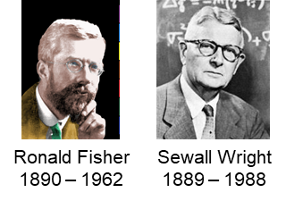
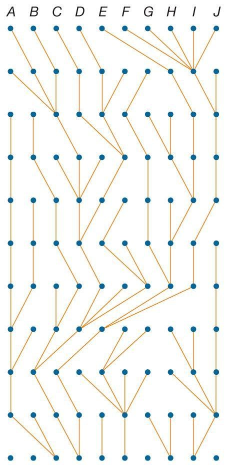
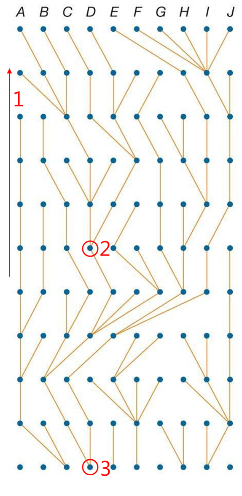

## Indavl, genetisk drift og populationsstruktur

### Hans R. Siegismund

### Teoretisk baggrund

De følgende noter har til formål at introducere begreberne *indavl*,
*genetisk drift* samt *populationsstruktur*. De to førstnævnte begreber
analyseres i opgaverne til denne øvelse, medens *populationsstruktur*
afsnittet danner baggrund for forelæsningen om dette
emne.

<figure>
  
 </figure>

Naturlige populationer har en endelig størrelse. Dette har til følge, at
et individ i en given generation kan have modtaget to gener, som er
kopier af det samme gen nogle generationer før. Disse to gener betegnes
da som *identiske ved arv*[^1]. Individet er så selvfølgelig homozygot
for enten den ene eller den anden allel, hvilket er illustreret i
figuren. (I dette eksempel indgår kun to forskellige alleler.) Når
generne ikke er identiske ved arv, kan de være homozygote for enten den
ene eller den anden allel[^2]. De kan også være heterozygote.

Der er to processer, som bidrager til at et locus i et individ kan blive
identisk ved arv:

- **Indavl**, hvor forældrene til individet er mere beslægtet med
  hinanden end to tilfældigt udvalgte individer i populationen.

- **Genetisk drift**, hvor den genetiske sammensætning i populationen
  ændres fra generation til generation på grund af tilfældige årsager.

De to processer har et forskelligt tidsperspektiv. Ved indavl kigger man
kun nogle få generationer tilbage i tiden. Desuden fokuserer man på et
specifikt individ. Ved genetisk drift ser man længere tilbage i tiden og
fokuserer på hele populationen. Se den følgende figur.

<figure>
  
 </figure>

Begge processer kan godt foregå samtidigt. Vi kan have en specifik
population, hvor vi kan beregne, hvorledes identiteten ved arv er steget
på grund af genetisk drift. I denne population kan der så desuden
forekomme tilfælde, hvor forældre til et afkom er mere beslægtet med
hinanden end to tilfældigt udvalgte individer.

##   Indavl

Som nævnt, så vil identiteten gennem arv øges i en population, hvis to
individer, der får afkom med hinanden, er mere beslægtede med hinanden
end to tilfældigt udvalgte individer i populationen. Identiteten gennem
arv kvantificeres ved hjælp af indavlskoefficienten *F*. Denne defineres
som sandsynligheden for, at et individ i et locus bærer to gener, der er
identiske ved arv, så

$<0 \leq F \leq 1$

Denne form for indavl medfører en afvigelse fra Hardy-Weinberg
proportioner, hvor genotypefordelingen i den enkelte population bliver

| Genotype | *A*1*A*1 | *A*1*A*2| *A*2*A*2 |
|----------|:------------------------------:|:-----------------------------:|:------------------------------:|
 Frekvens  | *p*2 + *Fpq*        | 2*pq*(1 − *F*)                | *q*2 + *Fpq*        |

Her observeres et *tydeligt overskud af homozygoter i forhold til
Hardy-Weinberg proportioner i den enkelte population* – i modsætning til
genetisk drift, hvor der er Hardy-Weinberg proportioner i den enkelte
population.

Vi skal i det følgende udlede, hvordan man beregner indavlskoefficienten
*F* for tilfældet hvor to individer, der er mere beslægtede med hinanden
end to tilfældigt udvalgte individer. Har et individ modtaget to kopier
af samme gen fra en stamfader (m/k), betragtes disse gener som værende
identiske ved arv. Kender man individets stamtavle, er det muligt at
beregne indavlskoefficienten. Her vil vi som eksempel beregne
indavlskoefficienten hos et barn, hvis forældre er fætter og kusine
(Figur A-C). I stamtavler får kvinder en cirkel,  medens mænd får
en firkant. Er kønnet ukendt, angives det som en firkant, der er drejet 45 grader.

<figure>
  
 </figure>

I Figur B er stamtavlen tegnet forenklet og indeholder kun de individer,
som er af betydning for indavlen af individ IV-1. Betegnelserne Ai, Aj,
Am og An står for vilkårlige alleler, som ikke er identiske ved arv. De
kan godt være ens alleler.

Barnet i fjerde generation (Figur C: IV-1) modtager to kopier af allelen
Ai, såfremt denne allel bliver videregivet langs begge mulige veje, som
forbinder dette barn med I-1. Under antagelse af at Mendel’s første lov
gælder, er sandsynligheden herfor (1/2)*n*, hvor *n* er det
antal gange allelen bliver videregivet i en meiose. I dette tilfælde er
*N* = 6. Barnet kan ligeledes blive identisk ved arv for allelen Aj
(Figur B) med sandsynligheden (1/2)6, så den samlede
sandsynlighed hvormed IV-1 bliver identisk ved arv med gener fra I-1 er

*F* = (1/2)6 + (1/2)6 = 2 (1/2)6 =
(1/2)5.

Vi ser her, at man blot behøver at tælle antallet af personer i kæden,
*n*, der forbinder en person over en stamfader; personen tælles dog ikke
selv med. Opløftes 1/2 med dette tal, har man bestemt
indavlskoefficienten.

*F* = (1/2)*n*.

IV-1 kan også blive identisk ved arv for allelerne Am og An, (Figur B)
som bæres af I-2. Denne sandsynlighed er ligeledes (1/2)5.
Hændelserne, at IV-1 bliver identisk ved arv for gener enten fra I-1
eller I-2, udelukker hinanden, så den samlede sandsynlighed for at blive
identisk ved arv er

*F* = (1/2)5 + (1/2)5 = 2 (1/2)5 =
(1/2)4 = 1/16.

I mere komplicerede stamtavler end den ovenstående med flere fælles
forfædre til et givent indavlet individ beregnes indavlskoefficienten
som summen af bidragene fra hver fælles stamfader efter det samme
princip som beskrevet foroven.

En populations indavlskoefficient *F* bestemmes ved at tage
gennemsnittet af de forskellige parringstypers indavlskoefficienter
*Fi* vægtet med deres frekvens *ci* i populationen

$$ \overline F = \sum_i c_iF_i.$$

## Genetisk drift

<figure>
  
 </figure>
I naturlige populationer forekommer der på grund af deres endelige
størrelse genetisk drift, hvor den genetiske sammensætning i
populationen ændres fra generation til generation på grund af tilfældige
årsager. Dette er illustreret i figuren. Her har man illustreret
simulationer for 10 populationer, der hver har en størrelse på 100
diploide individer. De startede med en frekvens af allel A på 0,5 i
generation 0. 

Vi måler indavlen hjælp af indavlskoefficienten, 
*Ft*, som er sandsynligheden for at et individ i et 
locus bærer to gener, der eridentiske ved arv – her målt i generation *t*.
Genetisk drift øger identitet gennem arv i populationen – det er dog
vigtig at pointere, at der stadigt foregår tilfældig parring i den
enkelte population, dvs, at ***der er Hardy-Weinberg proportioner*** i
det locus, der fokuseres på. Genetisk drifts effekt er afhængig af
populationens størrelse. Med en populationsstørrelse på *N* vil der være
2*N* gener i en diploid population. Her vil identitet gennem arv, målt
som indavlskoefficienten i generation *t*, *Ft*, vokse efter
formlen

$$F_t = 1 -\left(1- \frac{1}{2N}\right)^t$$

hvor det antages, at identiteten ved arv i generation 0 var 0.

Genetisk drift i isolerede populationer af endelig størrelse påvirker
udover **indavlskoefficienten *Ft*** af individerne også
***heterozygotien* *Ht*** og differentieringen mellem
populationerne i form af en øget ***varians af allelfrekvenser
Vt*** mellem populationerne Alle tre mål påvirkes i samme
grad af populationsstørrelsen, hvilket fremgår af de følgende formler,
hvor *t* er tiden målt i generationer.

$$
\begin{aligned}
F_t &=1 -\left(1- \frac{1}{2N}\right)^t\\  
H_t &= H_0\left(1- \frac{1}{2N}\right)^t\\  
V_t &=p_0(1-p_0)\left[(1 -\left(1- \frac{1}{2N}\right)^t\right]  \\
    &=p_0(1-p_0)F_t
\end{aligned}
$$

Her er *H*0 heterozygotien i generation 0, og *p*0
er allelfrekvensen i generation 0 (hvor alle populationer antages at
have haft den samme allelfrekvens før de blev splittet op i separate
populationer). Genetisk drift medfører således

1)  Tilvækst i indavl
2)  Tab af heterozygoti
3)  Differentiering af populationernes allelfrekvens, målt som stigning
    i variansen af allelfrekvenser mellem populationerne.

## Wright-Fisher modellen

<figure>
  
 </figure>

De ovennævnte effekter af genetisk drift er baseret på Wright-Fisher
modellen, der har fået navn efter Sewall Wright og Ronald R. Fisher – to
af den teoretiske populationsgenetiks grundlæggere (John B.S. Haldane
var den tredje.) Modellen introduceredes af Wright og Fisher i 1930erne.
Det er en simpel videreudvikling af Hardy- Weinberg loven, hvor man nu i
stedet for en uendelig stor populationsstørrelse antager at
populationens størrelse er endelig. Det medfører, at en given
populations genetiske sammensætning ændrer sig tilfældigt på grund af en
endelig størrelse af gameter, der udtrækkes til næste generation.
Effekten af at tage en endelig stikprøve beskrives nemmest ved hjælp af
en binomialfordeling. Antag, at vi har en population af diploide
individer med antallet *N,* og at hyppigheden af allel *A*1
er *p*1 i generation 0. Så er sandsynligheden for at der i
generation 1 er *j* *A*1-alleler i populationen givet ved

$$  p(j) = {2N \choose j}p_1^i (1-p_1)^{2N-j}$$

Ligningen giver en fuldstændig beskrivelse af fordelingen af antallet af
allel *A*1 i generation 1. Lad os starte med en population i
generation 0 med *N* = 16 og en allelfrekvens af *A*1 på 0,5.
Det er illustreret med den røde fordeling i nedenstående figur. Antag
nu, at vi i generation 1 har fået 5 *A*1 gameter i vores
stikprøve. (Sandsynligheden herfor er cirka 0,05.) Allelfrekvensen i
generation 1 har dermed ændret sig til *p*1 = 5/16 = 0,3125.
I denne generation vil sandsynligheden for at trække et givent antal
gameter af genotypen være givet ved den blå fordeling. Antag nu, at vi i
det konkrete tilfælde har fået trukket 2 *A*1 gameter i vores
stikprøve. Så bliver fordelingen af *A*1 gameter i generation
2 beskrevet af den grønne fordeling i figuren, hvor *p*1 =
2/16= 0,125. Og så videre…

<figure>
  
 </figure>

### Effektiv populationsstørrelse

Den genetiske drifts virkning er blevet beskrevet som væksten af
populationens indavlskoefficient *Ft*, for tabet af
heterozygoti *Ht* og som væksten af variansen *Vt*
mellem de enkelte populationer. Grundlaget for at udlede formlerne var
en model, som forudsætter ens populationsstørrelser gennem tiden,
selvbefrugtning tilladt og ens bidrag fra de enkelte individer i
populationen. Disse forudsætninger er sjældent opfyldte i naturlige
populationer. I naturen vil populationsstørrelsen ofte fluktuere gennem
tiden. Selvbefrugtning er næppe særligt udbredt i dyreverdenen, medens
det er mere almindeligt hos planter. Mange planter og de fleste dyr er
særkønnede og opfylder dermed heller ikke forudsætningerne for modellen.
I naturlige populationer vil antal afkom fra de enkelte individer ofte
være mere ujævnt fordelt, så variansen i antal afkom kan blive meget
stor.

Wright (1931)[^3] introducerede begrebet effektiv populationsstørrelse,
*Ne*, for at tage højde for mere realistiske situationer. Med
afvigelser fra modellen vokser indavlskoefficienten, *Ft*,
med en rate, som er specifik for den givne situation.

>>> *Den **effektive populationsstørrelse** defineres som populations-
 størrelsen i en ideal-population, der har samme tilvækst i genetisk
 drift som i den specifikke population.*

Vi kan illustrere effektiv populationsstørrelse ved hjælp af et
eksperiment med bananfluen *Drosophila melanogaster.* Her startede man
107 populationer, der i et givet locus havde to alleler med samme
allelfrekvens, dvs. 0.5. Frekvensen af heterozygoter i generation 0 var
derfor $2pq=2\times 0,5 \times 0,5 =0,5.$
Man holdt populationsstørrelsen i hver generation på 16. Derfor ville
man forvente, at heterozygotien ville aftage efter følgende formel

$$ H_t = 0,5\left(1-\frac{1}{2\times 16}\right)^t$$

Dette er illustreret ved den stiplede kurve i den følgende figur. I
virkeligheden faldt heterozygotien hurtigere. Den faldt med en rate, som
om populationsstørrelsen havde en størrelse på 9 og ikke 16. Det er vist
med den fuldt optrukne kurve i figuren. Den effektive
populationsstørrelse er derfor 9 for dette eksperiment med *Drosophila
melanogaster.*
<figure>
  
 </figure>

For en population med variabel størrelse, kan den effektive
populationsstørrelse beregnes som det harmoniske gennemsnit

$$ \frac{1}{N_{e}} = \frac{\underline{1}}{t}\sum_{i}^{t}{}\frac{1}{N_{i}}$$

hvor *Ni* er populationens størrelse i generation *i*. Det
samlede antal generationer sættes til *t*. Det antages, at der er lige
mange hanner og hunner i populationen.

Hvis kønsratioen i en population afviger fra 50% hunner og 50% hanner,
vil den effektive populationsstørrelse være mindre end den observerede.
Den kan estimeres med følgende formel

$${N_{e}} = \ \frac{4N_f\times N_m}{N_f+N_m}$$

hvor *Nf* og *Nm* er henholdsvis antallet af
hunner og hanner i populationen.

## Populationsstruktur

Betragt en stor population, der deles op i mange populationer, hver med
en størrelse på *N*. De enkelte populationer fikseres efterhånden på
grund af genetisk drift. Denne proces foregår uafhængig i de enkelte
populationer og medfører, at populationernes allelfrekvens divergerer
fra hinanden. Dette har følger for genotypestrukturen i
totalpopulationen, der er gennemsnittet hen over alle populationer. Her
vil genotypestrukturen kunne beskrives med den følgende fordeling

|Genotype|*A*1*A*1      |*A*1*A*2|*A*2*A*2     |
|--------|:----------------------------------:|:----------------------------:|:---------------------------------:|
|Frekvens|*p*2 + *Ftpq* |2*pq*(1 - *F*t)    |*q*2 + *Ftpq*|

<figure>
  
 </figure>

Her er *p* og *q* allelfrekvenserne i totalpopulationen, dvs. gennem-
snittet hen over alle populationer, dvs. *p* er lig med *p*0
og *Ft* er indavlskoefficienten givet i ligningerne foroven.
Det ses, at der er et *overskud af homozygoter i forhold til
Hardy-Weinberg proportioner og et tilsvarende underskud af
heterozygoter*. Den genetiske drifts effekt på den totale populations
genotypestruktur er den samme som indavlens effekt på en enkelt
populations afvigelse fra Hardy- Weinberg ligevægten, se foroven. Det er
vigtigt at fremhæve, at ***med genetisk drift er der stadigt
Hardy-Weinberg proportioner i de enkelte populationer***. ***Det er kun
i totalpopulationen, hvor der vil være et overskud af homozygoter.***
Dette er illustreret i
figuren.

Afvigelsen fra Hardy-Weinberg proportioner i totalpopulationen kan
benyttes til at kvantificere *populationsstrukturen*. Hvis alle
populationer har den samme allelfrekvens, må *F* være 0, og hvis de alle
er fikserede for enten den ene eller den anden allel, må *F* være lig
med 1. Her er der ingen heterozygoter i totalpopulationen. Man kan
beregne populationernes differentiering ved hjælp af

$$ V=p_0(1-p_0)F $$

hvor vi har droppet referencen til tiden *t*, som vi af gode grunde ikke
kender. Vi husker på, at den gennemsnitlige allelfrekvens kan bruges som
et godt bud på allelfrekvensen i populationen før den blev delt op.
Derfor kan vi beregne det, der kaldes Wright’s *F*-statistik, hvor vi
beregner den totale populations indavlskoefficient som
$$ F_{ST}= \frac {V} {p_0(1-p_0)}  $$

her er *V* variansen af allelfrekvensen hen over alle populationer og
*p*0 er den gennemsnitlige allelfrekvens. Bemærk, at vi her
har sat subskriptet *ST* på indavlskoefficienten
*FST*. Det blev introduceret af Wright for at kvantificere
differentieringen af **S**ubpopulationer i forhold til
**T**otalpopulationen.

En anden måde at beregne *FST* på er at se på, hvor meget
diversiteten i en totalpopulation nedsættes på grund af dens opsplitning
i subpopulationer. Her benyttes ligningen

$$ F_{ST}=\frac{{H_T-\overline{H}_S }}{H_T}$$

hvor *HT* er den forventede diversitet i totalpopulationen
beregnet under antagelse af tilfældig parring og hvor
$\overline{H}_{S}$ er den gennemsnitlige diversitet i
subpopulationerne. Lad os illustrere det med et simpelt eksempel. Antag,
at vi har to subpopulationer, der har allelfrekvenser for
*A*1 på 0,7 i subpopulation 1 og 0,3 i subpopulation 2 og
tilsvarende allelfrekvenser for *A*2 på 0,3 i subpopulation 1
og 0,7 i subpopulation 2. Endvidere antager vi
Hardy-Weinberg-proportioner i hver af subpopulationerne:

|                      | *A1A1* | *A1A2* | *A2A2* | Sum |
|----------------------| ---------------------------- |------------------------------|------------------------------|-----|
| Population 1         | 49                           | 42                           | 9                            | 100 |
| Population 2         | 9                            | 42                           | 49                           | 100 |
| Totalpopulation, obs | 58                           | 84                           | 58                           | 200 |
| Totalpopulation, HW  | 50                           | 100                          | 50                           | 200 |

Her indses, at 
$\overline{H}_{S}$ er 0,42 og at *HT* er 0,5.
Derfor kan vi beregne Wright’s F-statistik til at være

$$
\begin{aligned}
F_{ST} &=\frac{H_T -\overline{H}_{S}}
              {H_T}\\  
     &= \frac{0,5-0,42}{0,5}\\  
     &=0,16.
\end{aligned}
$$

I forbindelse med populationsstruktur er det passende at omtale
***Wahlund-effekten***, opkaldt efter den svenske genetiker Sten
Wahlund[^4]. Hvis man i en stikprøve blander individer fra to
populationer sammen, vil det medføre et overskud af homozygoter og et
tilsvarende underskud af heterozygoter i forhold til Hardy-Weinberg.
Dette er illustreret i ovenstående tabel. Det ses endnu tydeligere i det
mest ekstreme tilfælde, hvor de to populationer er fikseret for to
forskellige alleler. Hvis man samler lige mange individer fra hver
population (50 f.eks.), så får man den følgende sammensætning i
stikprøven:

|              |*A*1*A*1|*A*1*A*2|*A*2*A*2|Sum|
|--------------|:----------------------------:|:----------------------------:|:----------------------------:|:-:|
| Population 1 |50                            |                              |                              |50 |
| Population 2 |                              |                              |50                            |50 |
| Sum          |50                            |0                             |50                            |100|

Her er der et stort overskud af homozygoter i forhold til Hardy-Weinberg
proportionerne (25, 50, 25) og et tilsvarende underskud af
heterozygoter. Med andre allelfrekvenser vil effekten være mindre.

## Genetisk drift og indavl opgaver

### Formål

Disse øvelser har deres fokus på

- at illustrere genetisk drifts *tilfældige* virkning ved hjælp af
  simulationer
- samspillet mellem genetisk drift og naturlig selektion
- at beregne den *effektive populationsstørrelse* for tilfældet, hvor
  populationens størrelse ikke er konstant, samt tilfældet, hvor
  kønsratioen afviger fra 1 : 1
- simple egenskaber af coalescence processen
- at beregne indavlskoefficienter fra stamtavler

###  Opgave 1

*Simulering af genetisk drift*

Vi skal bruge Joe Felsenstein’s program PopG til at simulere genetisk
drift. Vi benytter
[<u>PopG.jar</u>](https://github.com/HansRSiegismund/Evolutionsbiologi/blob/main/Programmer/PopG.jar)
filen, der kræver at Java er installeret på den maskine, hvor man ønsker
at benytte programmet[^5]. (Det kan benyttes på Mac såvel på Windows
computere.) Man kan også hente
[<u>PopG.exe</u>](https://github.com/HansRSiegismund/Evolutionsbiologi/blob/main/Programmer/PopG.exe),
som er et Windows eksekverbart program. I kan finde en kort introduktion
til programmet [<u>her</u>](https://evolution.gs.washington.edu/popg/).

Programmet startes ved at dobbeltklikke på ikonen i den folder, hvor det
er blevet gemt i. Når programmet starter, findes der to menupunkter
“File” og “Run”. Vi skal udelukkende bruge “Run”. Klik på det, og
fortsæt med “New Run”. Dette viser den følgende kasse med
parameterværdier, der kan ændres.

<figure>
  
 </figure>

Når disse har fået de ønskede værdier, klikkes på OK-boks som vil starte
kørslen. Hvis man på noget tidspunkt ønsker at genstarte kørslen med
forskellige parameterværdier, kan man vælge “New Run”, og du får en
mulighed for at ændre på parametrene. Kørslen kan gentages ved at trykke
“Run” og dernæst vælge “Restart”.

Vi lader fitness af de tre genotyper være ens, 1, dvs. naturlig
selektion har ingen indflydelse. Vi simulerer 10 populationer, der er
isolerede fra hinanden. Derfor sættes “Migration Rate between
populations” til at være 0. Der foregår heller ikke mutationer, så
mutationsraterne sættes til at være 0. Start med ens frekvenser af de to
alleler.

Start med at sætte “Population Size” til 1000 og lad antallet af
generationer være 100.

1)  Gentag denne kørsel 5 gange. Hvad sker der med allelfrekvenserne i
    de enkelte populationer?

Klik for at se svaret.

<figure>
  
 </figure>

Allelfrekvenserne i de enkelte populationer divergerer fra hinanden.

2)  Ændrer allelfrekvenserne sig udelukkende i en retning (op eller
    ned)?

Klik for at se svaret.

Allelfrekvenserne ændrer sig tilfældigt.  De har ingen fast retning.

3)  Sæt populationsstørrelsen til 100 og gentag kørslen 5 gange. Hvordan
    adskiller disse kørsler sig fra de tidligere med en
    populationsstørrelse på 1000?

Klik for at se svaret.

<figure>
  
 </figure>

Populationerne divergerer hurtigere.  Effekten af genetisk drift tiltager med faldende populationsstørrelse

4)  Sæt populationsstørrelsen til 10 og gentag kørslen 5 gange. Hvordan
    adskiller disse kørsler sig fra de tidligere med en
    populationsstørrelse på 1000 og 100?

Klik for at se svaret.

<figure>
  
 </figure>

Genetisk drift virker endnu stærkere.  Med en populationsstørrelse på 10 ender stort set alle populationer med at blive fikseret inden der er gået 100 generationer

5)  Hvor mange populationer ville man teoretisk forvente blive fikseret
    for hver allel?

Klik for at se svaret.

Vi forventer, at den ene halvdel bliver fikseret for *A* og den anden halvdel for allel *a*. 

6)  Hvis frekvensen af allel *A* sættes til 0,9 (og frekvensen af allel
    *a* til 0,1), med hvilken frekvens forventer vi så, at populationer
    fikseres for de to alleler?

Klik for at se svaret.

Vi forventer, at 90% bliver fikseret for *A* og 10% for allel *a*, dvs. med den frekvens allelerne har i populationen på det tidspunkt, spørgsmålet stilles.

7)  Betragt en population, der starter med en frekvens af begge alleler
    på 0,5. Til generation *t* har frekvensen af allel *A* ændret sig
    til 0,8. Hvad er sandsynligheden nu for at populationen bliver
    fikseret for allel *A*?

Klik for at se svaret.

Det på være 0,8.  Populationer har ingen hukommelse. 

### Opgave 2

<figure>

  
 </figure>

Figuren til højre viser resultatet af 13 gentagne eksperimenter med en
kromosompolymorfi hos *Drosophila melanogaster.* Den viser hyppigheden
af én af de to kromosomformer gennem de fire generationer, som forsøget
varede. Man startede 6 af forsøgene hvor den ene type havde frekvenser
lidt højere end 0,9 og 7 af forsøgene havde en frekvens under 0,9.
Populationsstørrelserne i hvert forsøg var 100.

1)  Kan evolutionen i dette system forklares som en følge af genetisk
    drift? (Hvis intuitionen ikke rækker, kan man simulere 13
    populationer af størrelsen 100 over 10 generationer. Man kan
    starte dem med en allelfrekvens på 0,9 og lade fitness være ens
    for alle tre genotyper.)

Klik for at se svaret.

Nej. Det er højst usandsynligt, at driften i en population med en 
størrelse på 100 kan resultere i fiksering efter 4 generationer.  
Desuden ender alle 6 forsøg med allelfrekvens over ca. 0.9 med at 
blive fikseret for den ene allel, medens de 7 forsøg, der starter 
med en frekvens under 0.9, alle ender med at blive fikseret for 
den anden allel. Drift ville have en mere “tilfældig” karakter. 

Figuren nedenunder illustrerer genetisk drift i en population med 
en størrelse på 100 over 10 generationer med en frekvens af allel 
*A* på 0,9 i generation 0.
<figure>

  
 </figure>

2)  Kan evolutionen forklares som en følge af naturlig selektion?
    Hvorledes virker den i givet fald? Hvilken genotype har den
    laveste fitness?

Klik for at se svaret.

Ja, der er tale om underdominans, hvor heterozygoten har mindre fitness end begge homozygoter.

### Opgave 3

En evolutionsbiolog simulerede en population med en størrelse på 200
individer i fire forskellige scenarier (I-IV) med forskellige typer
naturlig selektion. Scenarierne var givet ved de følgende respektive
fitness-værdier for de tre genotyper i fire autosomale loci:

|Locus   | AA             | AB              | BB   |
|------- | -------------- | --------------- | ---- |
|I       | 1,2            | 1               | 1,2  |
|II      | 1              | 1               | 1    |
|III     | 0,8            | 1               | 0,8  |
|IV      | 1,1            | 1               | 0,9  |

Han simulerede 10 populationer for hvert scenarie i 50 generationer.

1)  Hvilken form for naturlig selektion er der tale om i de fire
    scenarier?

Klik for at se svaret.

- I) underdominans
- II) neutral evolution
- III) overdominans
- IV) retningsselektion (for allel A)

2)  Hvor mange ligevægte (stabile og ustabile) findes der for hvert af
    de fire scenarier?

Klik for at se svaret.

- I: 2 stabile (0, 1), 1 ustabil (0,5)
- II: ingen, allelfrekvensens ligevægt er neutral
- III: 2 ustabile (0, 1), 1 stabil (0,5)
- IV: 1 ustabil (1), 1 stabil (0) (allelfrekvensen er for A)

3)  Hvilket locus (I-IV) er illustreret i de følgende fire scenarier
    (A-D)? (begrundes kort)

Klik for at se svaret.

- I: C Når allelfrekvensen skubbes bort fra 0,5, fortsætter den enten mod 1 eller 0. Når frekvensen er over 0,6 eller under 0,4 bevæger den sig ikke tilbage og krydser 0,5.
- II: B Her divergerer allelfrekvenserne tilfældigt. Det kan gå både op og ned. Allelfrekvenserne spredes over et stadigt bredere interval med tiden.
- III: D Overdominant selektion med en ligevægtsfrekvens på 0,5 holder allelfrekrekvensen tæt på 0,5.
- IV: A Retningsselektion fikserer alle populationer med *p* = 1.

Bonuspoint: med selektionskoefficienter på 0,1, som er tilfældet her, og N =200, gælder der, at

2*Ns* > 1

Her er

2 × 200 × 0,1 = 40 >> 1.

Dvs., at det er naturlig selektion, der afgør udfaldet. Genetisk drift spiller ingen stor rolle.

<figure>
  
 </figure>

### Opgave 4

<figure>
  
 </figure>
 
I tiden fra 1961 til 1965 foretog Christian Vibe fra Zoologisk Museum i
København indfangning af 27 moskusokser, *Ovibos moschatus*, i
Østgrønland og flyttede dem til et område syd for Søndre Strømfjord i
Vestgrønland. Her trivedes de godt, og bestanden voksede, så de
oprindelige 14 tyre og 13 køer i 2018 er blevet til cirka 20.300
dyr[^6], af hvilke der årligt kan nedlægges en del individer.
Generationstiden for moskusoksen i dette område er cirka otte år, og
tætheden i de første fem generationer er opgjort
til

| Generation | Populationsstørrelse |
| :--------: | :------------------: |
| 1          | 27                   |
| 2          | 150                  |
| 3          | 834                  |
| 4          | 2400                 |
| 5          | 3500                 |
| 6          | 4000                 |

1)  Beregn populationens gennemsnitsstørrelse over de 6 generationer.

Klik for at se svaret.

 <figure>
  
 </figure>

2)  Beregn den effektive populationsstørrelse over de 6 generationer.

Klik for at se svaret.

 <figure>
  
 </figure>

3)  Hvilke generationers størrelse har størst indflydelse på den
    effektive populationsstørrelse?

Klik for at se svaret.

Det er generationerne med de ***små***  størrelser, der har den største indflydelse på den effektive populationsstørrelse.

### Opgave 5

I det moderne landbrug benyttes ofte meget få hanner til at inseminere
et stort antal hunner. Antag, at antallet af hunner, *Nf*, er
**meget** større end antallet af hanner, *Nm*.

1)  Hvad er den effektive populationsstørrelse (målt som funktion af
    *Nm*)? Divider tæller og nævner med *Nf*, og
    husk på at *Nm*/*Nf* → 0 når antallet af
    hunner er meget større end antallet af hanner.

$$
  \begin{aligned}N_e &= \frac{4N_f\times N_m}{N_f+ N_m}\\
    &= \frac{ 4N_m}{1+ N_m/N_f}\\
    &\approx 4N_m \quad \textrm{for} \quad N_f \rightarrow \infty\\
\end{aligned}
$$

Klik for at se svaret.

$$
  \begin{aligned}N_e &= \frac{4N_f\times N_m}{N_f+ N_m}\\
    &= \frac{ 4N_m}{1+ N_m/N_f}\\
    &\approx 4N_m \quad \textrm{for} \quad N_f \rightarrow \infty\\
\end{aligned}
$$

Klik for at se svaret.

$$
%\begin{aligned}
N_e = \frac{4N_f\times N_m}{N_f+ N_m}
    = ss
%\end{aligned}
$$

1)  Hvilken effekt har den hårde kunstige selektion på kort sigt?

Klik for at se svaret.

På kort sigt vil den hårde kunstige selektion virke meget stærk. Man vil kunne 
  “flytte” en karakters middelværdi hurtigt.

3)  Hvilken effekt kan det have på lang sigt?

Klik for at se svaret.

På lang sigt forventer vi, at der mistes en betydelig mængde genetisk 
variation pga. genetisk drift. Dette reducerer effekten af kunstig selektion.

###  Opgave 6

Betragt den følgende genealogi af *k* = 10 gener.
<figure>
  
 </figure>

1)  Angiv med en pil tidens retning.

2)  Find coalescent-punktet for genkopierne A, B, C og D.

3)  Find coalescent-punktet for alle genkopierne (Most recent common
    ancestor).

Klik for at se svaret for spørgsmål 1-3.

<figure>
  
 </figure>

4)  Bliver ventetiderne for coalescent-hændelser kortere eller længere
    jo mere tilbage i tiden man går?

Klik for at se svaret.

De bliver længere. Ventetiden får at gå fra $k$ til $k - 1$ gener er
$$\frac{4N}{{k(k-1)}}$$

5)  Hvor lang tid tager det for at gå fra *k*  gener til  to gener?
    (Forventet tid)

6)  Hvor lang tid tager det for de sidste to gener at finde sammen?
    (Forventet tid)

Klik for at se svaret for 5 og 6.

Tiden for at gå fra *k* til 2 gener er.
$$2N(1-1/k )\approx 2N \textrm{ hvis  }k\textrm{  ikke er alt for lille}$$

Ventetiden får at gå fra $k$ til $k - 1$ gener er
$$\frac{4N}{{k(k-1)}}$$

Så tiden for at gå fra 2 gener til 1 gen er
$$\frac{4N}{{2(2-1)}}= 2N$$

<figure>
  
 </figure>

### Opgave 7

Bestem indavlskoefficienten for afkom af parringer blandt

1) søskende

Klik for at se svaret.

<figure>
  
 </figure>

 *F* = (1/2)3 + (1/2)3 = (1/2)2 = 0,25

2) morbror-niece

Klik for at se svaret.

<figure>
  
 </figure>

 *F* = (1/2)4 + (1/2)4 = (1/2)3 = 0,125

1) selvbefrugtning

Klik for at se svaret.

<figure>
  
 </figure>

*F* = (1/2)1 = 0,5

[^1]: “Identical by descent” på engelsk. En anden betegnelse herfor er,
    at de er *autozygote*.

[^2]: “Identical by state” på engelsk. En anden betegnelse er, at de er
    *allozygote*. Vi har ikke en tilsvarende dansk betegnelse.

[^3]: Wright, S. (1931). Evolution in Mendelian populations. *Genetics*
    **16**: 97–159.

[^4]: Wahlund, S. (1928). Zusammensetzung von Populationen und
    Korrelationserscheinungen vom Standpunkt der Vererbungslehre aus
    betrachtet. *Hereditas* **11**: 65–106.

[^5]: Hvis ikke man har Java installeret på sin maskine, må man hente
    hjælp på internettet.

[^6]: Året for den seneste optælling af populationen. Se Cuyler *et al*.
    2020. Muskox status, recent variation, and uncertain future.
    [*<u>Ambio</u>*](https://link.springer.com/content/pdf/10.1007/s13280-019-01205-x.pdf)
**49**:805–819
