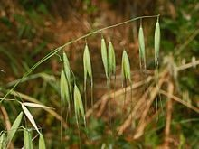
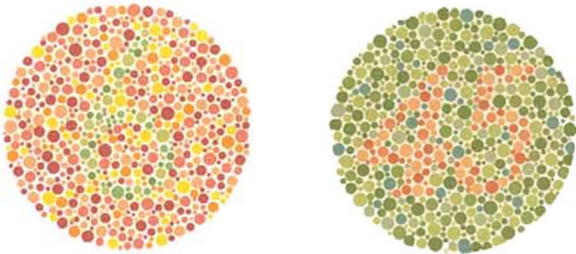
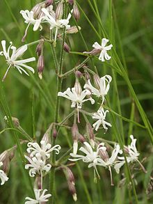
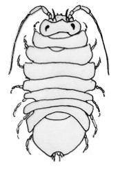

# Hardy-Weinberg samt variation i to loci

### Hans R. Siegismund

## Teoretisk baggrund

### Hardy-Weinberg loven

Betragt en diploid population, hvor vi ser på variation i et autosomalt
locus med to allele gener *A*1 og *A*2. Vi tager en stikprøve på *N* individer. Disse *N* fordeler sig på de tre genotyper som følger

 

 |Genotype |*A*1*A*1|*A*1*A*2|*A*2*A*2|Sum   |
 |---------|:----------------------------:|:----------------------------:|:----------------------------:|:----:|
 |Antal    |*N*11              | *N*12             |*N*22              | *N*  | 
 |Frekvens |*P*11              | *P*12             |*P*22              | 1    |   

 

***Genotypefrekvenserne** Pij* bestemmes ved at dividere
antallet af genotypen *Nij* med summen *N*

*Pij* = *Nij*/*N*.

***Allelfrekvenserne*** af *A*1 (*p*) og *A*2
(*q*) bestemmes ved simpel optælling af de to alleler i stikprøven, og
ved at huske at homozygoter bærer to alleler af samme slags. Vi har
derfor, at

*p* = (2*N*11 + *N*12) / (2*N*) =
*P*11 + *P*12/2

*q* = (2*N*22 + *N*12) / (2*N*) =
*P*22 + *P*12/2

1 = *p* + *q*
 

Populationen vil efter én generation under antagelse af tilfældig
parring, ingen selektion, Mendelsk udspaltning, osv. opnå en stabil
fordeling af genotypernes hyppigheder. Fordelingen af genotyperne blandt
afkommet bliver Hardy-Weinberg-ligevægten

 

| Genotype|*A*1*A*1|*A*1*A*2|*A*2*A*2|Sum  |
|---------|:----------------------------:|:----------------------------:|:----------------------------:|:---:|
|Antal    |*N*11              | *N*12             |*N*22              | *N* |
|Frekvens |*p*2               |2*pq*                         |*q*2               |1    |

 

Allelfrekvensen er konstant. Vi beregner den som

*p´* = *P*11 + *P*12/2
= *p*2 + 2*pq*/2
= *p*(*p + q*)
= *p*.

Hardy-Weinberg ligevægten er en ***neutral ligevægt*** med hensyn til
allelfrekvenser, forstået på den måde, at hvis allelfrekvensen ændrer
sig fra *p* til *p’*, så opstår der en ny Hardy-Weinberg ligevægt med
den nye allel-frekvens. Det kan f.eks. være genetisk drift, der ændrer
allelfrekvensen på grund af tilfældige ændringer. Hardy-Weinberg
ligevægten er en ***stabil ligevægt*** med hensyn til
genotypefordelingen. Det skal forstås på den måde, at hvis
allelfrekvensen ændrer sig fra *p* til *p’*, så opstår der en ny
genotypeligevægt med den nye allel-frekvens:

 

|Genotype|*A*1*A*1|*A*1*A*2| *A*2*A*2|Sum  |
|--------|:----------------------------:|:----------------------------:|:-----------------------------:|:---:|
|Frekvens|*p'*2              |2*p'q'*                       |*q*'2               |1    |

 

### Test af Hardy-Weinberg proportioner

I en stikprøve på *N* individer er den genetiske variation i et autosomalt locus med to allele gener *A*1 og *A*2
blevet bestemt. En test for overensstemmelse af de observerede gen­o­typefordelinger med de forventede Hardy-Weinberg proportioner kan
foretages på følgende måde (Det er en god idé både at bestemme *p* og *q*; hvis deres sum er lig med 1, har man regnet rigtigt!):

 

| Genotype  |*A*1*A*1   | *A*1*A*2| *A*2*A*2|Sum   |
|-----------|:-------------------------------:|:-----------------------------:|:-----------------------------:|:----:|
|Observeret |*N*11                 |*N*12               |*N*22               |*N*   |
|Forventet  |*E*11                 |*E*12               |*E*22               |*N*   |
|           |  =                              |  =                            |=                              |      |
|           |*p*2*N*               |2*pqN*                         |*q*2*N*             |*N*   |

 

Allelfrekvenserne bestemmes som beskrevet foroven. Når man angiver allelfrekvenser, bør man benytte et antal decimaler, der svarer til stikprøvens størrelse. For eksempel, hvis *N* \< 50 har det ingen mening at angive allelfrekvensen med mere end to decimaler. Det er dog vigtigt at beregne de forventede genotypefordelinger med værdier, der ikke afrundes.

Den observerede og den forventede fordeling kan sammenlignes med et “Goodness of fit”-test. Teststørrelsen

$$
\chi ^2=\sum_i \frac{(O_i-E_i)^2}{E_i}
$$

er tilnærmelsesvis χ2-fordelt med én enkelt frihedsgrad. Antallet af frihedsgrader fremkommer på følgende måde. Antallet af
frihedsgrader for at beskrive den observerede genotypefordeling er 2. Vi kender jo summen, og når vi kender de to, kan den tredje jo nemt
udledes. Antallet af frihedsgrader for at beskrive allelernes frekvens er én. Kender vi frekvensen af én allel, kan den andens frekvens jo bestemmes som dens difference fra 1. Testens frihedsgrader er differencen i antallet af frihedsgrader for at beskrive henholdsvis genotypefordeling og allelfordeling, hvilket er 2 – 1 = 1. Er
teststørrelsen større end 3,84 forkaster vi hypotesen på 5% niveauet; dvs., den genetiske variation i det betragtede locus anses for ikke at
være i overensstemmelse med Hardy-Weinberg proportioner. Hvis vi accepterer hypotesen, kan vi kun udtale at genotypefordelinger stemmer
overens med Hardy-Weinberg fordelingen; vi kan ikke sige noget om, hvorvidt der er Hardy-Weinberg ligevægt i populationen!!!

Et simpelt eksempel kan tjene som illustration: Antag, at begge homozygoter er sterile, så kun heterozygoter får afkom. Hvis vi betragter populationen af voksne, har vi en perfekt overensstemmelse til de forventede Hardy-Weinberg-proportioner, nemlig

 

| *A*1*A*1 |*A*1*A*2|*A*2*A*2 |
| :-----------------------------:|:----------------------------:|:----------------------------: |
| 1/4                            |1/2                           |1/4                            |

 

som er resultatet af udspaltningen af den eneste fertile kombination,
*A*1*A*2 × *A*1*A*2 i generationen
før. Vi ser, at selv med en særdeles hård selektion kan man have en
perfekt overensstemmelse med Hardy-Weinberg-frekvenser i en population.

 

### Afvigelser fra Hardy-Weinberg proportioner

Vi kan karakterisere afvigleser fra Hardy-Weinberg proportioner ved hjælp af indavlskoefficienten *F* (uddybes senere i kurset). Den kan defineres som

*F =* (*He – Ho*)/ *He*,

hvor *He* er lig med de forventede heterozygoter,
*He = 2pq*, og *Ho* er lig med de observerede
heterozygoter. (Man kan også benytte det observerede og forventede antal
heterozygoter, som i eksemplet forneden.) Der gælder så, at

*F \>* 0, hvis der er overskud af homozygoter

*F =* 0, hvis der er Hardy-Weinberg proportioner

*F \<* 0, hvis der er overskud af heterozygoter.

 <figure>
  
 </figure>

*Eksempel:*
Marshall og Allard (1970)[^1] undersøgte genetisk variation i et locus
hos den vilde hvede *Avena barbata* i Californien. De fandt den følgende genotypefordeling for dette locus

 

|    Genotype| *A*1*A*1 | *A*1*A*2| *A*2*A*2|Sum   |
|------------|:------------------------------:|:-----------------------------:|:-----------------------------:|:----:|
|Observeret  | 66                             |6                              |15                             |87    |
|Forventet   |54,72                           |28,55                          |  3,72                         |87    |

 

Hvor de forventede genotypefrekvenser er beregnet ud fra
Hardy-Weinberg-proportioner med frekvenserne for allel *A*1 og *A*2 på
henholdsvis *p* = 0.79 og *q* = 0.21. Indavlskoefficienten beregnes som

*F* = (28,55 *–* 6)/ 28,55 = 0,79.

Vi ser en stor afvigelse fra Hardy-Weinberg-proportioner med et stort
overskud af homozygoter (*F* \> 0). Årsagen hertil er, at *Avena
barbata* hovedsageligt forplanter sig ved selvbestøvning.

### Hardy-Weinberg proportioner med flere alleler

Det er let at udvide Hardy-Weinberg-loven til situationer med flere
alleler i et locus. Findes der for eksempel tre alleler i et autosomalt
locus, er Hardy-Weinberg-proportionerne givet i tabellen længere nede.
Det ses, at antallet af genotyper som funktion af antallet af alleler
*n* er givet ved *n*(*n* + 1)/2. Antallet af mulige genotyper vokser
hurtigt, og det er derfor lidet sandsynligt at alle genotyper, som
findes i populationen, repræsenteres i en given stikprøve. Bestemmelsen
af allelfrekvenser foretages analogt til det tidligere viste eksempel
for et locus med to alleler. Man tæller simpelt hen antallet af en given
allel og dividerer med det totale antal gener, som findes i stikprøven,
dvs. to gange det observerede antal individer.

Den forventede fordeling af genotyperne ved Hardy-Weinberg-ligevægt med
tre alleler er givet ved

 

|                |*A*1            |*A*2                |*A*3                |
|:--------------:|:-------------------------:|:-----------------------------:|:-----------------------------:|
|*A*1 |*p*12|2*p*1*p*2|2*p*1*p*3|
|*A*2 |                           | *p*22   |2*p*2*p*3|
|*A*3 |                           |                               |*p*32    |

 

### Variation i loci med dominante alleler

Bestemmelsen af allelfrekvenser i en population er forholdsvis enkel for
codominante alleler, hvor vi for hvert individ kan observere, hvilke
alleler det bærer. Situationen bliver lidt mere vanskelig, når der er
dominans mellem allelerne. Vi betragter et autosomalt locus med to
alleler, *D* og *d*, hvor *D* dominerer over *d*. Der findes derfor to
fænotyper i populationen, nemlig *D−* og *dd*, hvor vi kun hos den
sidste entydigt er i stand til at bestemme dens genotype. Fænotypen *D−*
er enten homozygot *DD* eller heterozygot *Dd*. Hvis vi antager, at
betingelserne for Hardy-Weinberg-ligevægten er opfyldt i populationen,
og at allelerne *D* og *d* optræder med hyppighederne *p* og *q*, kan
populationens sammensætning beskrives på følgende måde

| Genotype       |*DD* $\qquad$ *Dd*        |*dd*               |     |
| :--------------|:------------------------:|:-----------------:|:---:|
|                |└───┬───┘                 |                   |     |
|Fænotype        |*D-*                      |  *dd*             | Sum |
| Observeret     |*N**D*-        |*N**dd* | *N* |
| HW-Frekvens    |*p*2+2*pq*     |*q*2*N* | *N* |
| HW-Forventet   |(*p*2+2*pq*)*N*|*q*2*N* | *N* |

 

Allelfrekvenserne beregnes ud fra relationen mellem frekvensen af den
recessive allel og frekvensen af den recessive homozygot. Da vi har, at

$$
q^2\times N = N_{dd}
$$

får vi dermed, at

$$
q=\sqrt{N_{dd}/N}
$$

og

$$
p = 1 – q.
$$

Forudsætningen herfor er, som allerede nævnt, at der er
Hardy-Weinberg-proportioner for dette locus i populationen. Såfremt
dette ikke er opfyldt, vil denne fremgangsmåde ikke resultere i et
meningsfyldt resultat. Vi har ingen mulighed for at teste for
Hardy-Weinberg-proportioner, da fænotypefordelingen beskrives med én enkelt frihedsgrad. De beregnede allelfrekvenser beskrives ligeledes med én enkelt frihedsgrad, så der er ingen frihedsgrader til en test.

### Variation i kønsbundne loci

Hardy-Weinberg loven blev udledt for variation i et autosomalt locus. Kønsbundne loci opfører sig lidt anderledes. Vi vil nu se på et simpelt system, hvor kønnet bestemmes af to forskellige kønskromosomer, *X* og *Y*, som det blandt andet kendes fra pattedyr og hos få særkønnede planter som humle og hamp. Her hører bærere af to *X*-kromosomer til det homogametiske køn (hunner), medens bærere af et *X*- og et *Y*-kromosom tilhører det heterogametiske køn (hanner).

Vi ser på variation, der bestemmes af gener, som sidder på *X*-kromosomet. Hunnerne bærer to kopier af sådanne gener, medens hannerne kun har én kopi, de er hemizygote. Betragt en population, hvor der i et locus A er observeret to alleler, *X*1 og *X*2. Hos hunnerne findes derfor tre genotyper,
*X*1*X*1, *X*1*X*2 og
*X*2*X*2, medens der hos hannerne kun forekommer
to genotyper, *X*1*Y* og *X*2*Y*. Frekvenserne af
de to alleler bestemmes hos hunnerne som i et autosomalt locus, se
tidligere. Hos hannerne er det lidt nemmere at bestemme frekvenserne af
*X*1 og *X*2, de er lig med frekvenserne af hanner
med genotyperne *X*1*Y* og *X*2*Y*. Vi antager nu, at allelfrekvenserne er ens hos hanner og hunner, nemlig *p* og *q* for allel *X*1 og *X*2. Hvis vi antager, at der foregår tilfældig gametsammensmeltning, så vil de forventede frekvenser af de mulige fem genotyper være givet ved

 

|         |Hunner                        |                              |                              |Hanner            |                  |
|---------|:----------------------------:|:----------------------------:|:----------------------------:|:----------------:|:----------------:|
|Genotype |*X*1*X*1|*X*1*X*2|*X*2*X*2|*X*1*Y*|*X*2*Y*|
|Forventet|*p*2               |2*pq*                         |*q*2               |*p*               |*q*               |
 

Forskellen i genotypefordelingen mellem hanner og hunner bliver specielt
tydeligt i tilfælde, hvor den ene allel dominerer over den anden. Her
vil den recessive fænotype være langt hyppigere hos hannerne. Hvis vi
antager, at *X*2 er recessiv over for *X*1, vil
den forekomme med en frekvens, der er 1/*q* større end
*X*2*X*2 homozygoten hos hunnerne. Hos sjældne
arvelige sygdomme som hæmofili (blødersygdommen) hos mennesket er det
derfor meget sjældent at observere syge kvinder. Det er stort set kun
mænd, der lider af denne sygdom.

 <figure>
  
 </figure>

*Eksempel*: Rød-grøn farveblindhed nedarves kønsbundet hos mennesket.
Personer, der er rød-grøn farveblinde, kan ikke se tallene 6 og 45 i de
to figurer.

 

# Hardy-Weinberg øvelser

## Formål

Disse øvelser har deres fokus på

- at beregne genotype-og allelfrekvenser   for autosomale og kønsbundne loci med codominans mellem allelerne 
  for autosomale loci med dominans mellem allelerne
- at beregne forventede Hardy-Weinberg frekvenser
- at teste for afvigelser fra Hardy-Weinberg frekvenser
- at kvantificere afvigelser fra Hardy-Weinberg frekvenser ved hjælp af   indavlskoefficienten *F*

 

### Opgave 1

Betragt de følgende genotypefordelinger i fem autosomale loci (I-V).

 

|Locus |11  |12  |22 |Sum |
|:-----|---:|---:|--:|---:|
|I     |100 |0   |0  |100 |
|II    |81  |18  |1  |100 |
|III   |0   |100 |0  |100 |
|IV    |0   |0   |100|100 |
|V     |50  |0   |50 |100 |
 

 

Bemærk: Hvis der er afvigelser fra Hardy-Weinberg proportioner i
forskellige loci, kan de selvfølgeligt ikke være noget, der foregår i
den samme population.

1)  Hvad er frekvensen for allel 1 i de fem fordelinger?

2)  Hvilke af de ovenstående fordelinger udviser Hardy-Weinberg
    proportioner og hvilke gør ikke? (Test burde ikke være nødvendig.)
 fem fordelinger?

3)  Hvad kan have forårsaget afvigelser fra Hardy-Weinberg proportioner?

 

###  Opgave 2

Rhesus-systemet er af stor betydning ved blodtransfusioner og kan
forvolde komplikationer ved graviditeter, hvor kvinde og foster har
uforenelige blodtyper. Der findes to fænotyper i Rhesus-systemet:
Rhesus-positiv (Rh+) og Rhesus-negativ (Rh−). Den følgende tabel viser
udspaltninger i Rhesus-systemet hos de tre mulige forældrekombinationer:

 

|                     |                | Børn |     |     |
|---------------------|----------------|------|-----|-----|
| Forældrekombination | Antal familier | Rh+  |     | Rh− |
| Rh+ × Rh+           | 73             | 248  |     | 16  |
| Rh+ × Rh−           | 20             | 54   |     | 23  |
| Rh− × Rh−           | 7              | −    |     | 34  |
|                     | Sum hos børn   | 302  |     | 73  |

 

 1) Beregn allelfrekvenserne blandt børnene. (Benyt det totale antal
 børn, og husk at nedarvningen af variationen i Rhesus systemet blev
 gennemgået i første øvelsesgang.)
 2) Hvilken antagelse hviler beregningen på?

Ved fødsler brister placentabarrieren, hvorved der trænger lidt af
fostrets blod over i moderen. En Rhesus-negativ kvinde, som føder sit
første Rhesus-positive foster, bliver derved immuniseret mod fostrets
antigen og danner antistoffer. Ved næste graviditet transporteres disse
antistoffer til fostret via placentaen og skader fostret. Nu til dags
kan man dog forebygge de fleste forekomster af sygdommen.

 c\) Mod hvilken genotype virker selektionen, som skyldes Rhesus-sygdommen?

 

### Opgave 3
 <figure>
  
 </figure>

Nikkende limurt (*Silene nutans*) er en hermafroditisk selvkompatibel[^2] plante. I en undersøgelse af planten fandt man den følgende genotypefordeling i et enzymlocus hos henholdsvis nyspirede frøplanter samt hos
frøproducerende voksne planter i en population fra Langtved:

 

|                 | 11     |  12   |22 |Sum|
|:--------------- | ------ | ----- |-- |---|
|Frøplanter       | 79     |  43   |21 |143|
|Voksne           | 55     |  47   |10 |112|

 

 a\) Bestem allelfrekvenserne hos begge grupper.

b\) Er allelfrekvenserne forskellige hos de to grupper? (Test er ikke
nødvendig)

 c\) Stemmer genotypefordelingerne overens med Hardy-Weinberg proportioner for hver af grupperne?
 

 d\) Bestem indavlskoefficienten *F* for begge grupper. *F* =
 (*He* – *Ho*)/*He*, hvor
 *He* og *Ho* er henholdsvis forventet og
 observeret hyppighed af heterozygoter. Når *F* er positiv, er der
 overskud af homozygoter i forhold til Hardy-Weinberg proportioner, og
 hvis den er negativ, er der overskud af heterozygoter i forhold til
 Hardy-Weinberg proportioner.

e) Hvad kan have forårsaget en eventuel afvigelse fra Hardy-Weinberg
 proportioner?

Antag, at de voksne som frøplanter havde samme afvigelse fra
Hardy-Weinberg proportioner, som observeres hos frøplanter.

 f\) Forklar, hvad der sker fra frøplante-stadiet til voksenstadiet.

 

### Opgave 4

En stikprøve af katte i Singapore havde følgende fordeling af pelsfarven:

 

|        | Mørk | Middel | Lys | Sum |
|--------|------|--------|-----|-----|
| Hunner | 63   | 55     | 12  | 130 |
| Hanner | 74   | 0      | 38  | 112 |

 

Der er åbenlys forskel på hanner og hunner. Lad derfor være med at slå
dem sammen. Start med at analysere hunnerne for sig:

a\) Bestem allelfrekvenserne, *p*(♀, M) og *p*(♀, L), og test om genotypefordelingen stemmer overens med Hardy-Weinberg forventningerne.

Hos hannernes observeres der slet ikke fænotypen Middel.

b\) Bestem frekvensen af de to observerede fænotyper hos hannerne.

c)  Sammenlign frekvensen af de to alleler hos hunnerne med frekvensen    af de to fænotyper hos hannerne. (Kvalitativt – en test skal ikke     laves.) Giv en forklaring på, hvordan farverne nedarves hos katte.

 

### Opgave 5 (for nørder)
 <figure>
  
 </figure>

På danske strande med forekomst af sten, på høfder og i algebevoksninger
kan man finde arter af isopod-slægten *Jaera*. De er ret små; hannerne
op til 3 mm og hunnerne op til 5 mm. (Billedet viser en hun.) I en prøve
indsamlet i Nivå bugt fandtes den følgende fordeling af variation i et
enzymlocus hos arten *Jaera ischiosetosa*:

 

|Køn      |11| 12| 22 |Sum|
|:--------|--:|---:|---:|--:|
|Hunner |0 |99| 0| 99|
|Hanner | 0| 0| 93| 93|

 

a)  Er genotypefordelingerne i de to køn betragtet uafhængigt af  hinanden og som sum over de to køn i overensstemmelse med  Hardy-Weinberg proportioner? (Det er ikke nødvendigt, at udføre en   formel *χ*2-test.)

Der er også undersøgt tre andre loci, der alle viste overensstemmelse
med Hardy-Weinberg proportioner, så man kan gå ud fra, at der synes at
være tilfældig parring i populationen.

b)  Forklar, hvordan den i tabellen fundne variation nedarves.

 

## Variation i to loci
Disse opgaver har deres fokus på

- at beregne haplotypefrekvenser for to loci ud fra allelfrekvenser i de   enkelte loci for tilfældet med koblingsligevægt (*D* = 0).

- at undersøge populationsstrukturens effekt på dannelse af   koblingsuligevægt

### Opgave 6

Betragt en population, hvor der variation i to loci. Frekvensen af allel
*A* i locus *A* er 0.7. Frekvensen af allel *a* er 0.3. I det andet
locus, *B*, er frekvensen af allel *B* 0.8, og frekvensen af allel *b*
er 0.2. De to loci er i koblingsligevægt.

a)  Hvad er frekvensen af de fire mulige haplotyper?

 

### Opgave 7

En uerfaren biolog har taget en stikprøve fra to populationer I og II. Population I er fikseret for allel *A* i locus *A*, d.v.s alle er *AA*. Den er ligeledes fikseret for allel *B* i locus *B*, d.v.s alle er *BB*. Den anden population (II) er fikseret for forskellige alleler i de to loci, d.v.s alle er *aa* og *bb*. Problemet er, at han ikke vidste, at der var to forskellige populationer. Han har taget det samme antal stikprøver i hver population.

a)  Hvilke haplotyper findes i den samlede stikprøve og hvad er deres
    frekvens?

b)  Hvad er “coefficient of linkage disequilibrium” *D* i dette  tilfælde?

 
[^1]: Marshall & Allard (1970) Maintenance of isozyme polymorphism in
    natural populations of *Avena barbata*. *Genetics* 66: 393–399.

[^2]: Dvs, den er i stand til at bestøve sig selv.
