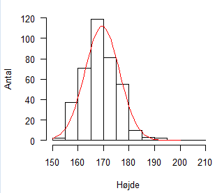
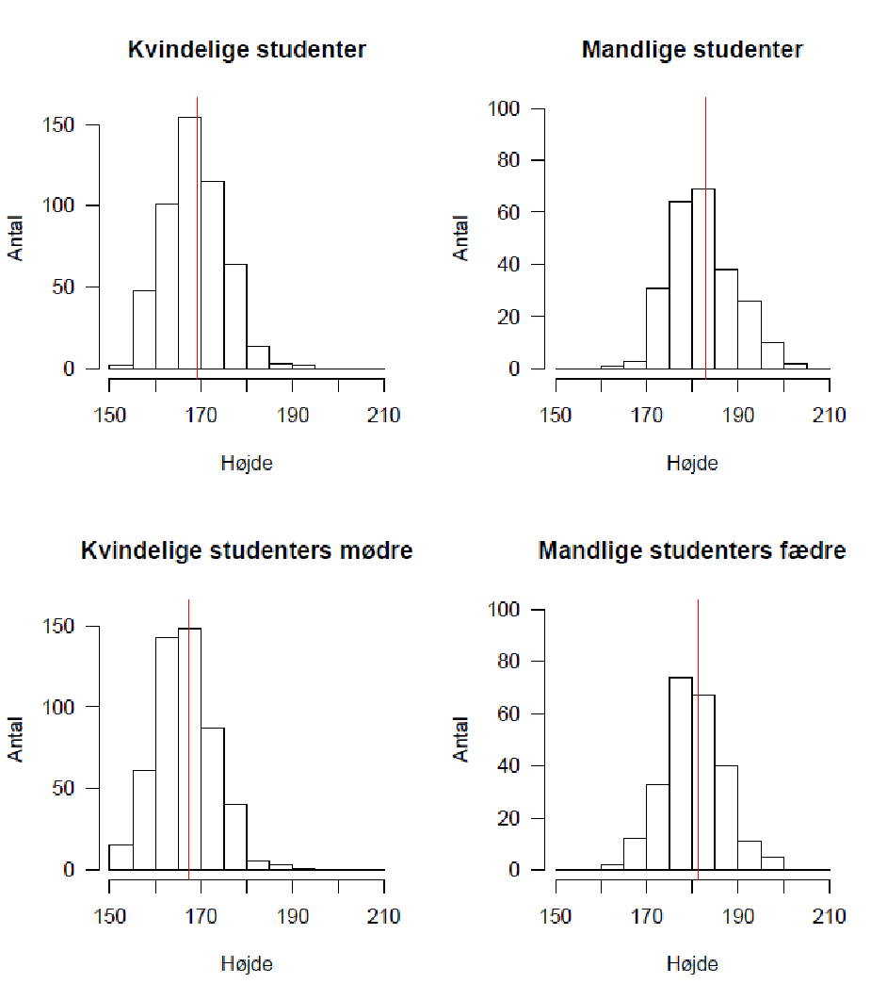
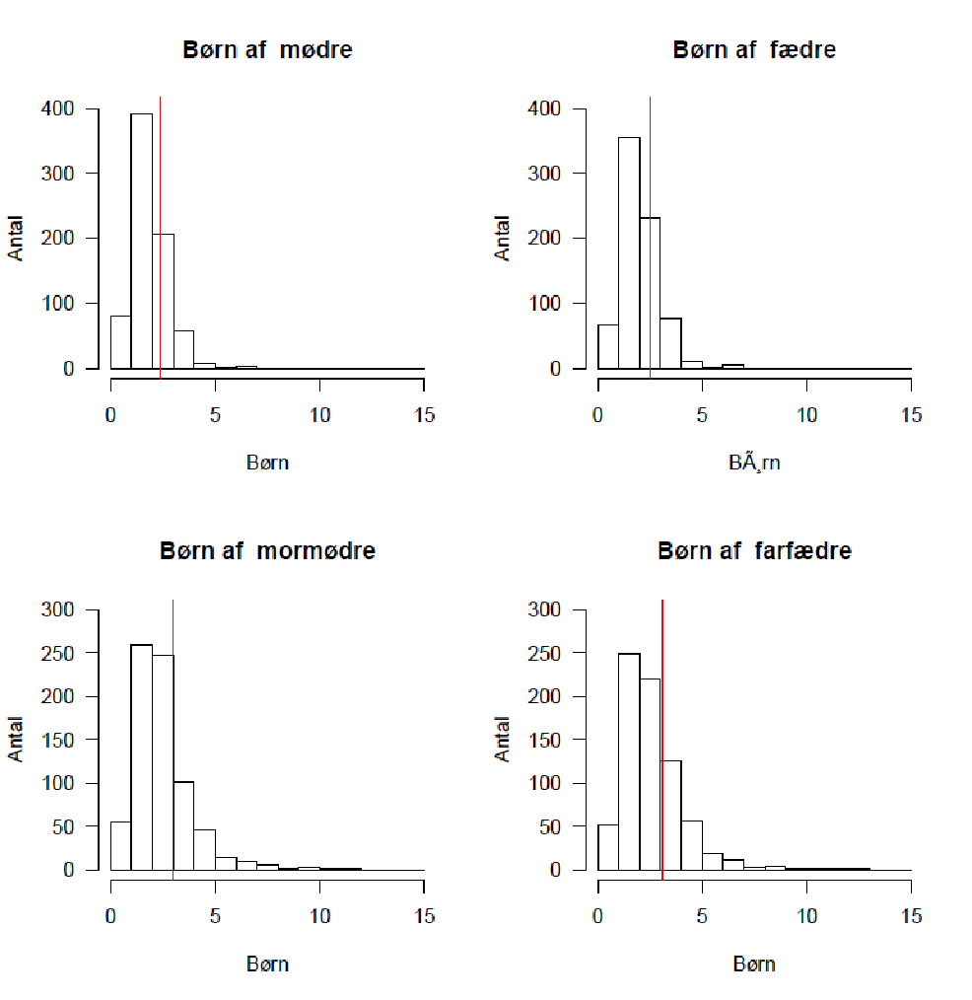
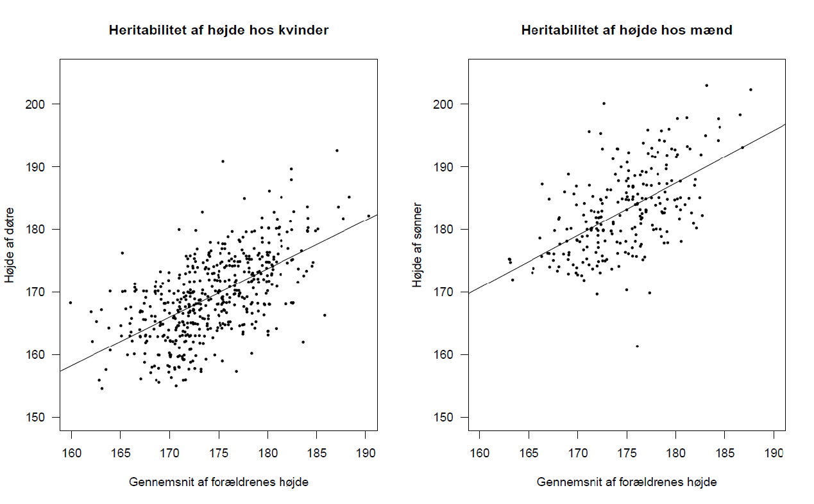

# Kvantitativ genetik

## Hans R. Siegismund

## Teoretisk baggrund

<figure>
  
 </figure>
 
Kvantitative karakterer er under indflydelse fra variationen fra et
større antal loci. Disse karakterer udviser fænotypisk variation, hvor
forskellene mellem individer ofte er så små, at de kan være svære at
måle, og hvor det er vanskeligt at beskrive den genetiske baggrund, der
bestemmer dem. Et eksempel er illustreret i den følgende figur, som
viser højden hos 380 kvindelige delagere i kurset i evolutionsbiologi.
Til denne kategori hører også antal afkom, overlevelse og andre
egenskaber, der er knyttet til et dyrs eller en plantes evne til at
producere afkom til næste generation. De sidstnævnte karakterer er alle
komponenter af fitness, der i sig selv kan betragtes som en kvantitativ
karakter. Et kendskab til den genetiske baggrund af disse karakterer og
til deres genetiske diversitet i naturlige populationer er derfor
nødvendig for at forstå arters muligheder for at tilpasse sig til
ændringer i det fysiske eller biologiske
miljø.

For at beskrive en population må vi ty til statistiske metoder. Det mest
simple består i at afbilde fordelingen på en passende skala. Ud fra
denne beregnes så størrelser som middelværdi og varians. Kvantitative
karakterer deles ofte op i kontinuerte og tællelige karakterer. Som
navnet antyder, så vil fordelingen af kontinuerte karakterer kunne
beskrives med en sandsynlighedsfordeling langs en akse, der er
kontinuert. Hertil hører for eksempel vægt, længde eller diameter af
stammen på træer. Disse karakterer kan måles med forskellige fysiske
eller kemiske metoder, og deres størrelse vil være en funktion af den
anvendte skala og af “måleinstrumentets” nøjagtighed. I princippet vil
disse karakterer være kontinuert fordelt, men for det meste grupperes de
i klasser. Fordelingen vil ofte—såfremt man har valgt en passende
skala—være normalfordelt. Dette er vist med den røde kurve i figuren
ovenfor, hvor man har benyttet middelværdi og variansen af de
observerede fordeling og indsat i formlen for normalfordelingen.

Tællelige karakterer optræder som diskrete enheder, det vil sige, at de
kan tælles med hele tal. Hertil hører eksempler som antallet af
hvirvler, afkom, børster og hår. Skalaen er givet på forhånd. Når
antallet af observerede kasser er forholdsvist stort, vil deres
fordeling også kunne tilnærmes med en normalfordeling.

### Komponenter af den fænotypiske varians

Skal en karakter beskrives for en given population, afbildes fordelingen
af fænotypen, og dens middelværdi og varians beregnes. Spørgsmålet er
nu, hvor stor en del af den fænotypiske varians er genetisk betinget, og
hvor stor en del skyldes miljøet? Konkret kan det formuleres som

$$
V_P = V_G + V_E
$$

hvor *VP* er den fænotypiske, *VG* er den
genetiske og *VE* er miljø-variansen. (Forkortelserne er
engelske, de står for henholdsvis “phenotypic”, “genetic” og
“environmental variance”.) Vi vil nu opsplitte den genetiske varians i
dens komponenter og se på, hvorledes disse kan estimeres. Den genetiske
varians består af en additiv varians *VA*, en
dominans-varians *VD* og en interaktionsvarians
*VI* ,

$$
V_G = V_A + V_D + V_I
$$

Dominansdelen skyldes afvigelse fra additive effekter indenfor de
enkelte loci (se figuren nedenfor), medens interaktionsvariansen er
forårsaget af ikke-additive bidrag fra de for- skellige loci. Et andet
navn for denne er epistatisk varians.

<figure>
  
 </figure>

Genotypiske værdier for en kvantitativ karakter. Foroven: additive
bidrag fra allelerne. Forneden: dominansinteraktion mellem allelerne,
til venstre ufuldstændig dominans, til højre overdominans.

For en given karakter, der analyseres, kan vi fra en stikprøve
udelukkende bestemme den ***fænotypiske middelværdi***, $\overline{x}$,
samt den ***fænotypiske varians***, $V_P$
(*P* står for det engelske phenotype). Variansen bestemmes som

$$
V_P = \sum_{i=1}^2\frac{(x_i-\overline{x})^2}{n-1}
$$

Hvor der er indsamlet *n* stikprøver. Vi er interesseret i, hvor stor en
brøkdel af den fænotypiske varians, der består af ***genetisk varians***, $V_G$,
og hvor stor en del, der består af ***miljøvarians***, $V_E$.
Dette kan læses i afsnit 1.3 “Fænotypisk variation” i “Introduktion til
Populationsgenetik”, hvor der gives en kort gennemgang og forklaring af
de vigtigste kvantitativ-genetiske begreber.

En af de vigtigste parametre er ***“narrow sense” heritabiliteten***, $h^2_N$.
Den er defineret som den brøkdel den ***additive genetiske varians***,
$V_A$, udgør af den totale fænotypiske varians, $V_P$, det vil sige

$$
h^2_N =\frac{V_A}{V_P}
$$

<figure>
  
 </figure>

Heritabiliteten beregnes nemt ved regressioner mellem beslægtede
individer. Det kan vises, at heritabiliteten er lig med  regressionskoefficienten *b* mellem afkommets værdi og *forældrenes
middelværdi* for den observerede karakter, det vil sige

$$
h^2_N =b.
$$

Det er vist i figuren  for højde hos kvindelige og mandligestudenter, der
har deltaget i kurset i evolutionsbiologi.

Laves en regression mellem afkom og *den ene forælder*, kan det vises,
at heritabiliteten er lig med to gange regressionskoefficienten *b*
mellem afkommets og forælderens værdi for den observerede karakter, det
vil sige

$$
h^2_N =2b.
$$

Regressionskoefficienten *b* findes som

$$
b =\frac{\mathrm{Cov}(x,y)}{V(x)}
$$

hvor $\mathrm{Cov}(x, y)$ er covariansen mellem *x* og *y*, der bestemmes som

$$
\mathrm{Cov}(x,y) = \sum_{i = 1}^{n}(x_i-\overline{x})(y_i-\overline{y})
$$

Her er der indsamlet *n* parvise kombinationer af *x* og *y* værdier.

## Selektion på kvantitativ karakter

Naturlig selektion i et autosomalt locus med to alleler kunne opdeles i
tre forskellige typer

<figure>
  
 </figure>

1.  Retningsselektion, hvor de tre genotyper havde fitnessværdier, enten
    som $W_{11} \ge W_{12} \ge W_{22}$     højst ét lighedstegn eller som
    $W_{11} \le W_{12} \le W_{22}$ med højst ét lighedstegn.
    
<figure>
  
 </figure>
 
2.  Overdominans, hvor heterozygoten havde en højere fitness end begge
    homozygoter, $W_{12} \ge W_{11}$   og $W_{12} \ge W_{22}$.
    

<figure>
  
 </figure>

3.  Underdominans, hvor heterozygoten havde en lavere fitness end begge
    homozygoter,  $W_{11} \ge W_{12}$   og $W_{22} \ge W_{12}$.

For kvantitative karakterer har vi tilsvarende typer for selektion, der
illustreret i den efterfølgende figur. De tre typer er

1.  Retningsselektion, hvor sandsynligheden for at overleve stiger som
    funktion af karakterens værdi. Her vil middelværdien forskydes til
    højre efter selektionen har virket på karakteren. (Man kan
    selvfølgeligt også have det omvendte tilfælde, hvor
    sandsynligheden for at overleve aftager som funktion af
    karakterens værdi.)

2.  Stabiliserende selektion, hvor sandsynligheden for at overleve er
    størst for individer med intermediære værdier af karakteren. Her
    vil naturlig selektion i ligevægten sørge for at middelværdien for
    karakteren er konstant.

1.  Disruptiv selektion, hvor individer med ekstreme karakterer har en
    øget sandsynlighed for at overleve end individer, der har en
    karakter tæt på middelværdien. Med denne selektion øges variansen
    af karakteren.
    
<figure>
  
 </figure>
    

## Opgaver til Kvantitativ Genetik

### Formål

I de følgende opgaver fokuseres der på de følgende emner med baggrund i
kvantitativ genetik

- Assortativ parring
- Komponenter af fænotypiske varians
- Heritabilitet
- Breeders equation, *R = h*2*S*

### Opgave 1

I denne opgave analyseres to kvantitative karakterer hos mennesket,
nemlig højde og antal børn. Data er blevet indsamlet over flere år på
kurset i evolutionsbiologi. (Se de efterfølgende figurer og tabeller.

Den følgende figur viser sammenhængen mellem de studerendes forældres
højder. Vi kan benytte dette for at se om der er “assortativ parring”
med hensyn til højde hos mennesket, dvs., om der er en tendens til høje
mennesker finder en partner, der også er høj, samt at lave mennesker har
den samme tendens.
   
<figure>
  
 </figure>

1)  Figuren indeholder regressionslinjen for mødres højde som funktion
    af fædres højde. Den har hældningen 0,061. Korrelationskoefficienten
    er 0,068, som ikke er signifikant på 0,05 niveauet. Er der tegn på
    “assortativ parring”?

De følgende figurer viser fordelingerne af højde for mandlige og
kvindelige studerendes højde, samt for deres forældres højde.
   
<figure>
  
 </figure>

|Højde                       |Gennemsnit |Varians  |*N*    |
|----------------------------|:---------:|:-------:|:-----:|
|Kvindelige studenter        |169,33     |42,84    |503    |        
|Kvindelige studenters mødre |167,35     |40.43    |503    |
|Mandlige studenter          |182,98     |47,24    |244    |
|Mandlige studenters fædre   |181,24     |40,68    |244    |

2)  Hvordan ændres højden for de to køn sig mellem generationerne? Man
    kan vise, at forskellen er statistisk signifikant for begge køn.
    (Det skal ikke gøres her.)

<figure>
  
 </figure>

|           |Gennemsnit |Varians  |*N*    |
| ----------|:---------:|:-------:|:-----:|
| Mødre     |2,38       | 0,79    | 503   |
| Mormødre  |2,99       | 2,17    | 503   |
| Fædre     |2,51       | 0,89    | 244   |
| Farfædre  |3,10       |2,36     | 244   |

3)  Hvordan ændres antallet af børn for de to køn sig mellem
    generationerne? Man kan vise, at forskellen er statistisk
    signifikant for begge køn. (Det skal ikke gøres her.)

4)  Forklar **kort**, om forskellene i højden og antal børn skyldes
    genetiske eller miljømæssige forskelle mellem generationerne.

5)  Hvad sker der med variansen af børn mellem de to generationer? (Man
    kan vise, at forskellen er statistisk signifikant for begge køn.
    \[Det skal ikke gøres her.\]) Hvilken effekt har det på genetisk
    drift? For at belyse dette, kan man se på ændringen af den effektive
    populationsstørrelse mellem generationerne. Hvis ikke man kan
    argumentere tilstrækkeligt med baggrund i sin intuition, kan man
    eventuelt benytte den følgende formel, der viser forholdet mellem
    den effektive populationsstørrelse og den aktuelle
    populationsstørrelse
    
$$\frac{N_e}{N} \approx \frac{2}{k-1 +\frac{\displaystyle V_k}{\displaystyle k}}
$$
    
  Her er *k* er det gennemsnitlige antal børn, og *Vk* er
variansen af antal børn. Det er den effektive populationsstørrelse for
kvinder, der her er tale om. (Normalt er *Ne* mindre end
*N*, men der kan ske det modsatte.) Tag udgangspunkt i mormødre og
mødre.

6)  Hvilke andre forhold end varians af antal børn spiller ind på
    genetisk drifts virkning i en population?

 figure>
  
 </figure>

    
<figure>
  
 </figure>
 

De følgende tabeller viser varianser og covarianser, som er nødvendige
for at beregne “narrow sense” heritabilitet for højde hos mennesket.

*Varianser og covarianser for højde hos kvinder*

|Varians af forældrenes gennemsnitshøjde \[*V*(*x*)\]                 |21,21| 
|Covarians af datters og forældres gennemsnitshøjde \[*Cov*(*x*,*y*)\]|24,82|
|Antal observationer                                                  |503  |                               

*Varianser og covarianser for højde hos mænd*

|Varians af forældrenes gennemsnitshøjde \[*V*(*x*)\]                 |24,82|
|Covarians af datters og forældres gennemsnitshøjde \[*Cov*(*x*,*y*)\]|19,23|
|Antal observationer                                                  |503  |

| Varians af forældrenes gennemsnitshøjde \[*V*(*x*)\]                 |21,21 |
| Covarians af sønnens og forældres gennemsnitshøjde \[*Cov*(*x*,*y*)\]|17,77 |
| Antal observationer                                                  |244   |

7)  Beregn “narrow sense” heritabiliteten for højde hos mennesket (for
    kvinder og mænd).

De følgende figurer viser antallet af mødres antal børn som funktion af
mormødres antal børn, samt fædres antal børn som funktion af farfædres
antal børn. Sammenhængen mellem disse benyttes til at beregne
heritabiliteten af antal børn. Antallet af streger ud fra et punkt
viser, hvor mange observationer, der er gjort for dette punkt.

 figure>
  
 </figure>

De følgende tabeller viser varianser og covarianser, som er nødvendige
for at beregne “narrow sense” heritabilitet for antal børn hos
mennesket.

Varianser og covarianser for antal børn hos kvinder

|                                                           |       |
|-----------------------------------------------------------|-------|
| Varians af mormors antal børn \[*V*(*x*)\]                | 2,175 |
| Covarians af mor og mormors antal børn \[*Cov*(*x*,*y*)\] | 0,176 |
| Antal observationer                                       | 747   |

Varianser og covarianser for antal børn hos mænd

|                                                            |       |
|------------------------------------------------------------|-------|
| Varians af farfars antal børn \[*V*(*x*)\]                 | 2,360 |
| Covarians af fars og farfars antal børn \[*Cov*(*x*,*y*)\] | 0,306 |
| Antal observationer                                        | 747   |

8)  Beregn “narrow sense” heritabiliteten for antal børn hos mennesket.

Hos mange andre arter har man observeret lignende forskelle i
heritabilitet mellem karakterer, der er fitnessrelaterede (som antal
børn) og karakterer, der ikke er så direkte knyttet til fitness (som
højde).

9)  Hvad skyldes denne forskel?

I Frankrig er den gennemsnitlige højde for mænd 177 cm og 163 cm for
kvinder. Heritabiliteten for højde i Frankrig er af samme størrelse som
den, der er fundet i denne opgave.

10) Er forskellen i højde mellem danske og franske befolkning genetisk
    betinget?

**Opgave 2**

Betragt en eksperimentel population af rotter, hvor man i 40
generationer har selekteret for hårlængde, som i løbet af forsøget
øgedes fra et gennemsnit på 8 mm til 16 mm. I den første generation, som
havde en gennemsnitlig hårlængde på 8 mm, udvalgtes forældre med en
gennemsnitlig hårlængde på 10 mm. Deres afkom havde en gennemsnitlig
hårlængde på 9 mm.

1)  Bestem heritabiliteten (narrow sense) for denne karakter i den
    første generation.

I generation 39 var den gennemsnitlige hårlængde 15,8 mm, hvoraf man
udvalgte forældre med en gennemsnitlig hårlængde på 17 mm. I generation
40 var gennemsnittet 16

2)  Bestem heritabiliteten på dette tidspunkt.

3)  Forklar forskellen i heritabiliteten mellem de to tidspunkter.

Man stoppede selektionseksperimentet og observerede i de følgende
generationer et fald i hårlængden.

4)  Giv en forklaring på dette fald.

**Opgave
3**

Den efterfølgende figur illustrerer et forsøg, hvor man i 60
generationer kunstigt har selekteret for et øget antal børster på
abdomen hos bananfluen *Drosophila melanogaster.* Selektionen foregik
ved at man i hver generation udvalgte de 10 % af hannerne og hunnerne,
som havde det højeste antal børster til at være forældrene til næste
generation. Som det ses, så øgedes antallet af børster gennem kunstig
selektion. Det foregik imidlertid ikke jævnt. Perioder med stigende
antal børster afløstes af perioder med næsten konstant antal, som så
efterfulgtes af en pludselig stigning som respons på selektionen.

1)  Hvorledes ændres heritabiliteten sig under forløbet?

2)  Hvilke biologiske fænomener kan have forårsaget at et plateau
    afløses af en periode med stigende respons på selektionen?

**Opgave 4**

Den afrikanske finke (*Pyrenestes ostrinus*) er blevet studeret af
Thomas Bates Smith. Fugle i denne art findes i to grupper med forskellig
næbstørrelse; en gruppe med store næb og en gruppe med små næb. Figuren
til højre viser en fordeling af næbstørrelsen i en naturlig population i
Cameroun (som størrelse for næbstørrelsen er vist bredden af næbbet).

Bates Smith analyserede udspaltningen af afkom fra forskellige parringer
i en population. Der foregår tilfældig parring med hensyn til
næbstørrelse. Den følgende figur viser stamtavler for forskellige
krydsninger. I stamtavlen får hunner en cirkel, **○**, medens hanner får
en firkant, **□**. Er kønnet ukendt, angives det som . Individer med
stor næbstørrelse er angivet med L (Large), medens individer med små næb
er angivet med S
(Small)

.

1)  Benyt stamtavlerne til at udlede den genetiske baggrund for
    fænotyperne S og L. Angiv hvilke genotyper, der bestemmer de to
    fænotyper og angiv dominansforhold. Begrundes ***kort***.

2)  Angiv genotyperne for forældrene i stamtavle nr. 4.

3)  Hvad er indavlskoefficienten af individet, der er angivet med en
    pil, hvis vi antager at olde- og bedsteforældrene er ubeslægtede?

Finken lever hovedsageligt af frø, hvor størrelsen af de frø, der
spises, er korreleret med næbstørrelsen. Finker med små næb spiser små
bløde frø, medens finker med store næb spiser store hårde frø.
Fordelingen over næbstørrelsen vises for unge fugle, hvor de mørke
søjler er dem, der overlever til voksenstadiet, medens de lyse søjler
viser fugle, som ikke overlever til voksenstadiet.

4)  Hvilken form for naturlig selektion virker, når man betragter begge
    størrelsesklasser af finken?

5)  Hvilken form for naturlig selektion virker, når man betragter de to
    størrelsesklasser af finken hver for sig?

**Opgave 5**

Fra en meget stor population af bananfluer indfanges der en stikprøve,
der bruges til et kvantitativt genetisk forsøg. De holdes på en konstant
populationsstørrelse i hver generation (*N* = 15). Man analyserer en
kvantitativ genetisk karakter, hvis fænotypiske varians
(*VP*) udelukkende består af additiv genetisk varians
(*VA*) og miljøvarians (*VE*),

*VP* = *VA* + *VE*.

Additiv genetisk varians aftager på samme måde som gendiversitet som
følge af genetisk drift,

*VA*(*t*) = *VA*(0)(1 – 1/(2*N*))*t*,

Hvor *VA*(*t*) og *VA*(0) er henholdsvis den
additive genetiske varians i generation *t* og i generation 0.

1)  Hvor stor en brøkdel af den additive genetiske varians er der
    tilbage efter 16 generationer?

2)  Forventes *VA* at gå mod nul, når tiden går mod uendelig,
    eller er der andre ting, der modvirker dette?

Man laver et selektionseksperiment med fluer, der stammer fra den 16.
generation og med fluer, der indsamles fra den store vilde population.
Man selekterer ved, at man udvælger en gruppe individer, der i
gennemsnit har fire enheder mere end populationens gennemsnit, der er 10
enheder (gælder for begge populationer.). Heritabiliteten er 0,75 i den
vilde population. Den fænotypiske varians for karakteren er 8 i
populationen.

3)  Hvad er miljøvariansen i den vilde population?

4)  Hvad er middelværdien af afkomsgenerationen i populationen, der har
    været i laboratoriet, og den, der er indsamlet på ny?

Man indsamler fluer fra en anden population, der viser sig at have den
samme heritabilitet for karakteren, nemlig 0,75. Her er gennemsnittet af
karakteren 14

5)  Kan man på denne baggrund sige, at forskellen mellem de to
    populationer genetisk betinget?

**Opgave 6**

Fie er forsker og arbejder med at fremavle kalkuner med hurtigere vækst.
Den egenskab Fie selekterer på er, hvor hurtigt kalkunerne opnår en
slagtevægt på 6 kg. I gennemsnit tager det almindelige kalkuner 12 uger
at opnå en vægt på 6 kg. Heritabiliteten i snæver forstand,
*h*2, for dette træk er 0,4. Fie vil etablere en avlsstamme
for hurtigere vækst. Hun udvælger en gruppe kalkuner, som i gennemsnit
vejer 6 kg efter kun 11 uger, og deres afkom udgør første
afkomsgeneration.

1)  Hvor stort er selektionsdifferentialet?

2)  Hvor mange uger vil det i gennemsnit tage for den første
    afkomsgeneration, at opnå en vægt på 6 kg?

Fie har brugt en del SNP-markører i sit avlsarbejde. Når hun
sammenligner nukleotiddiversiteten i udgangspopulationen med
nukleotiddiversiteten efter 8 generationer, opdager hun at diversiteten
er faldet til det halve.

3)  Ud fra det slutter hun, at den effektive populationstørrelse i
    avlspopulationen har været ca. 6 under selektionseksperimentet.
    Hvordan kommer hun til det resultat?

4)  Fie mener, at det er vigtigt at bevare så meget af den genetiske
    variation som muligt i avlsstammen. Hvilke(n) faktor(er) vil påvirke
    tabet af genetiske variation i avlsstammen og hvordan kan Fie
    modvirke dette?

**Besvarelser til opgaver i Kvantitativ Genetik**

**Formål**

I de følgende opgaver fokuseres der på de følgende emner med baggrund i
kvantitativ genetik

- Assortativ parring

- Komponenter af fænotypiske varians

- Heritabilitet

- Breeders equation, *R = h*2*S*

**Opgave 1**

I denne opgave analyseres to kvantitative karakterer hos mennesket,
nemlig højde og antal børn. Data er blevet indsamlet over flere år på
kurset i evolutionsbiologi. (Se de efterfølgende figurer og tabeller.

Den følgende figur viser sammenhængen mellem de studerendes forældres
højder. Vi kan benytte dette for at se om der er “assortativ parring”
med hensyn til højde hos mennesket, dvs., om der er en tendens til høje
mennesker finder en partner, der også er høj, samt at lave mennesker har
den samme tendens.

1)  Figuren indeholder regressionslinjen for mødres højde som funktion
    af fædres højde. Den har hældningen 0,061. Korrelationskoefficienten
    er 0,068, som ikke er signifikant på 0,05 niveauet. Er der tegn på
    “assortativ parring”?

> Ikke ret meget, det ligner jo et skud hagl, og signifikansniveauet er
> over 0,05. Det ser ud som om danskerne finder sammen stort set
> tilfældigt med hensyn til højde.

De følgende figurer viser fordelingerne af højde for mandlige og
kvindelige studerendes højde, samt for deres forældres højde.

Højde Gennemsnit Varians *N*

—————————————————————————————

Kvindelige studenter 169,33 42,84 503

Kvindelige studenters mødre 167,35 40.43 503

Mandlige studenter 182,98 47,24 244

Mandlige studenters fædre 181,24 40,68 244

2)  Hvordan ændres højden for de to køn sig mellem genera­tionerne? Man
    kan vise, at forskellen er statistisk signifikant for begge køn.
    (Det skal ikke gøres her.)

> For kvinderne stiger højden med 1,98 cm og for mændene med 1.74 cm.
> Det ligner en parallelforskydning mod større højder.
>
> Man har data for mændenes højde tilbage i tiden, da denne er blevet
> målt på sessionerne. I den følgende figur vises data for danske (og
> franske) mænd fra begyndelsen af det nittende århundrede og op til
> slutningen af det tyvende århundrede. Det ses, at danske mænds højde
> er vokset fra 166 cm i 1830 til 183 i 1980, dvs 17 cm på 150 år, dvs.
> 2,83 cm per generation, hvis vi regner med en generationstid på 25 år.
> Stregen her har en længde på 17 cm (Hvis I printer siden ud i fuld
> størrelse på A4).

Antal børn Gennemsnit Varians *N*

———————————————————————————

Mødre 2,38 0,79 503

Mormødre 2,99 2,17 503

Fædre 2,51 0,89 244

Farfædre 3,10 2,36 244

3)  Hvordan ændres antallet af børn for de to køn sig mellem
    generationerne? Man kan vise, at forskellen er statistisk
    signifikant for begge køn. (Det skal ikke gøres her.)

> Antallet af børn hos mødre aftager med 0,61. Hos fædrene aftager
> antallet af børn med 0,59.
>
> Bemærk, at hverken fædrene eller mødrene til de studerende har fået
> flere end 7 børn, medens der hos mormødrene observeres helt op til 12
> børn og hos farfædrene 13 børn.
>
> Værdierne er ikke gældende for den danske population som helhed.
> Værdierne er biased opad. Vi har jo kun medtaget personer, der har
> fået mindst et barn i de foregående to generationer.

4)  Forklar **kort**, om forskellene i højden og antal børn skyldes
    genetiske eller miljømæssige forskelle mellem generationerne.

Det skyldes formentligt miljømæssige forskelle mellem generationerne.
Miljøet har generelt forbedret sig i forhold til folks størrelsesvækst.
Ændringerne med hensyn til antal børn skyldes kulturelle ændringer,
hvilket også kan henføres til miljøet.

# Bemærk (dette er *ikke* en del af den korrekte besvarelse): En høj heritabilitet (her for højde) betyder, at variationen i en population hovedsageligt skyldes variation mellem genotyper. Det betyder dog ikke, at fænotypen er givet fordi vi kender genotypen. Ændringer i miljøet kan selvfølgeligt ændre en genotypes fænotype, og populationen kan dermed ændre sin middelværdi. Tilsvarende kan gennemsnittet for en karakter med lav heritabilitet også ændres, når miljøet ændres.

5)  Hvad sker der med variansen af børn mellem de to generationer? (Man
    kan vise, at forskellen er statistisk signifikant for begge køn.
    \[Det skal ikke gøres her.\]) Hvilken effekt har det på genetisk
    drift? For at belyse dette, kan man se på ændringen af den effektive
    populationsstørrelse mellem generationerne. Hvis ikke man kan
    argumentere tilstrækkeligt med baggrund i sin intuition, kan man
    eventuelt benytte den følgende formel, der viser forholdet mellem
    den effektive populationsstørrelse og den aktuelle
    populationsstørrelse

> 
>
> Her er *k* er det gennemsnitlige antal børn, og *Vk* er
> variansen af antal børn. Det er den effektive populationsstørrelse for
> kvinder, der her er tale om. (Normalt er *Ne* mindre end
> *N*, men der kan ske det modsatte.) Tag udgangspunkt i mormødre og
> mødre.
>
> **Intuition**: Jo større variansen er i antal afkom, des større er
> effekten af genetisk drift. Variansen i antal afkom er aftaget
> dramatisk: fra 2,37 til 0,73. Derfor er genetisk drift aftaget i den
> danske population.
>
> **Formel**: Mor: *Ne*/*N =* 2/(2,38 – 1 + 0,79/2,38) = 1,17
>
> Mormor: *Ne*/*N =* 2/(2,99 – 1 + 2.18/2,99) = 0,74
>
> Vi ser her en stor effekt. Genetisk drift har næsten fået halveret sin
> effekt.

6)  Hvilke andre forhold end varians af antal børn spiller ind på
    genetisk drifts virkning i en population?

> Kønsratio, der afviger fra 1:1 i særkønnede arter.
> Populationssvingninger igennem tid.

De følgende tabeller viser varianser og covarianser, som er nødvendige
for at beregne “narrow sense” heritabilitet for højde hos mennesket.

Varianser og covarianser for højde hos kvinder

|                                                                       |       |
|-----------------------------------------------------------------------|-------|
| Varians af forældrenes gennemsnitshøjde \[*V*(*x*)\]                  | 24,82 |
| Covarians af datters og forældres gennemsnitshøjde \[*Cov*(*x*,*y*)\] | 19,23 |
| Antal observationer                                                   | 503   |

Varianser og covarianser for højde hos mænd

|                                                                       |       |
|-----------------------------------------------------------------------|-------|
| Varians af forældrenes gennemsnitshøjde \[*V*(*x*)\]                  | 21,21 |
| Covarians af sønnens og forældres gennemsnitshøjde \[*Cov*(*x*,*y*)\] | 17,77 |
| Antal observationer                                                   | 244   |

7)  Beregn “narrow sense” heritabiliteten for højde hos mennesket (for
    kvinder og mænd).

*h*2*N* (kvinder) *=* *b =Cov*(*x*,*y*)/ *V*(*x*)
= 19,23/24,82 = 0.77

*h*2*N* (mænd) *=* *b =Cov*(*x*,*y*)/ *V*(*x*) =
17,77/21,21 = 0.84

De følgende figurer viser antallet af mødres antal børn som funktion af
mormødres antal børn, samt fædres antal børn som funktion af farfædres
antal børn. Sammenhængen mellem disse benyttes til at beregne
heritabiliteten af antal børn. Antallet af streger ud fra et punkt
viser, hvor mange observationer, der er gjort for dette punkt.

De følgende tabeller viser varianser og covarianser, som er nødvendige
for at beregne “narrow sense” heritabilitet for antal børn hos
mennesket.

Varianser og covarianser for antal børn hos kvinder

|                                                           |       |
|-----------------------------------------------------------|-------|
| Varians af mormors antal børn \[*V*(*x*)\]                | 2,175 |
| Covarians af mor og mormors antal børn \[*Cov*(*x*,*y*)\] | 0,176 |
| Antal observationer                                       | 747   |

Varianser og covarianser for antal børn hos mænd

|                                                            |       |
|------------------------------------------------------------|-------|
| Varians af farfars antal børn \[*V*(*x*)\]                 | 2,360 |
| Covarians af fars og farfars antal børn \[*Cov*(*x*,*y*)\] | 0,306 |
| Antal observationer                                        | 747   |

8)  Beregn “narrow sense” heritabiliteten for antal børn hos mennesket.

*h*2*N* (kvinder) *=* 2*b =*2 *Cov*(*x*,*y*)/
*V*(*x*) = 2 × 0,176/2,175 = 0,162

*h*2*N* (mænd) *=* 2*b =*2 *Cov*(*x*,*y*)/
*V*(*x*) = 2 × 0,306/2,360 = 0,259

Hos mange andre arter har man observeret lignende forskelle i
heritabilitet mellem karakterer, der er fitnessrelaterede (som antal
børn) og karakterer, der ikke er så direkte knyttet til fitness (som
højde).

9)  Hvad skyldes denne forskel?

Heritabiliteten for karakterer, der er nært knyttede til fitness, har
ofte en forholdsvis lav heritabilitet. Dette skyldes, at naturlig
selektion har virket på karakteren og herved reduceret dens
heritabilitet.

I Frankrig er den gennemsnitlige højde for mænd 177 cm og 163 cm for
kvinder. Heritabiliteten for højde i Frankrig er af samme størrelse som
den, der er fundet i denne opgave.

10) Er forskellen i højde mellem danske og franske befolkning genetisk
    betinget?

> Det ved vi intet om. Heritabiliten fortæller kun noget om den brøkdel
> af den fænotypiske varians, som den additive varians udgør,
> *h2* = *VA*/*VP*. Den fortæller
> ***intet*** om forskelle mellem populationer. Det kan man undersøge i
> common garden eksperimenter, hvor man lader de samme genotyper leve i
> de forskellige miljøer, som man vil undersøge for en eventuel effekt.

**Opgave 2**

Betragt en eksperimentel population af rotter, hvor man i 40
generationer har selekteret for hårlængde, som i løbet af forsøget
øgedes fra et gennemsnit på 8 mm til 16 mm. I den første generation, som
havde en gennemsnitlig hårlængde på 8 mm, udvalgtes forældre med en
gennemsnitlig hårlængde på 10 mm. Deres afkom havde en gennemsnitlig
hårlængde på 9 mm.

1)  Bestem heritabiliteten (narrow sense) for denne karakter i den
    første generation.

*h*2 = *R*/*S* = (9 – 8)/(10 – 8) = 0,5

I generation 39 var den gennemsnitlige hårlængde 15,8 mm, hvoraf man
udvalgte forældre med en gennemsnitlig hårlængde på 17 mm. I generation
40 var gennemsnittet 16

2)  Bestem heritabiliteten på dette tidspunkt.

*h*2 = *R*/*S* = (16 – 15,8)/(17 – 15,8) = 0,2/1,2 = 0,17

3)  Forklar forskellen i heritabiliteten mellem de to tidspunkter.

Selektionen ændrer den genetiske sammensætning af populationen, her ved
enten at fiksere alleler eller ved at nærme sig ligevægte, hvorved den
addiditve genetiske varians i forhold til den fænotypiske varians
reduceres.

Man stoppede selektionseksperimentet og observerede i de følgende
generationer et fald i hårlængden.

4)  Giv en forklaring på dette fald.

> Faldet skyldes naturlig selektions virkning. Pleiotrope effekter af de
> selekterede gener kan have reduceret fitness og bliver nu selekteret
> imod af naturlig selektion. Der kan også have været selekteret
> skadelige gener koblet til de selekterede loci igennem hitchhiking.
> Efter den kunstige selektion ophører, bliver de skadelige gener
> elimineret gennem naturlig selektion.

**Opgave 3**

Den efterfølgende figur illustrerer et forsøg, hvor man i 60
generationer kunstigt har selekteret for et øget antal børster på
abdomen hos bananfluen *Drosophila melanogaster.* Selektionen foregik
ved at man i hver generation udvalgte de 10 % af hannerne og hunnerne,
som havde det højeste antal børster til at være forældrene til næste
generation. Som det ses, så øgedes antallet af børster gennem kunstig
selektion. Det foregik imidlertid ikke jævnt. Perioder med stigende
antal børster afløstes af perioder med næsten konstant antal, som så
efterfulgtes af en pludselig stigning som respons på selektionen.

1)  Hvorledes ændres heritabiliteten sig under forløbet?

> Heritabiliteten aftager jævnt og ender med værdien 0 når der nås et
> plateau. (Når der ikke er respons (*R* = 0) må heritabiliteten være 0;
> *R* = *h*2*S*)

2)  Hvilke biologiske fænomener kan have forårsaget at et plateau
    afløses af en periode med stigende respons på selektionen?

> Mutationer kan bidrage med fornyet variation, der bidrager til en
> fornyet respons på selektionen. Det er nok mere sandsynligt, at der på
> grund af rekombination er skabt ny variation, der selekteres på.
> Betragt en række loci på et kromosom, hvor + er en allel, der bidrager
> positivt til den kvantitative karakter og 0 ikke bidrager med noget.
> Der findes to kromosomer i populationen(++++0000 og 0000++++), og
> dermed tre genotyper
>
> 11 12 22
>
> ++++0000 ++++0000 0000++++
>
> ======== ======== ========
>
> ++++0000 0000++++ 0000++++
>
> Hvis allelerne alle er additive, vil de have den samme fænottype; der
> er jo 8 +’er i hver genotype. Det er først når der sker en
> rekombination, hvor man for dannet kromosomet ++++++++ at selektionen
> kan fiksere populationen for dette kromosom og hvor gennemsnittet så
> vil stige til 16.

**Opgave 4**

Den afrikanske finke
(*Pyrenestes ostrinus*) er blevet studeret af Thomas Bates Smith. Fugle
i denne art findes i to grupper med forskellig næbstørrelse; en gruppe
med store næb og en gruppe med små næb. Figuren til højre viser en
fordeling af næbstørrelsen i en naturlig population i Cameroun (som
størrelse for næbstørrelsen er vist bredden af næbbet).

Bates Smith analyserede udspaltningen af afkom fra forskellige parringer
i en population. Der foregår tilfældig parring med hensyn til
næbstørrelse. Den følgende figur viser stamtavler for forskellige
krydsninger. I stamtavlen får hunner en cirkel, **○**, medens hanner får
en firkant, **□**. Er kønnet ukendt, angives det som . Individer med
stor næbstørrelse er angivet med L (Large), medens individer med små næb
er angivet med S (Small)

.

1)  Benyt stamtavlerne til at udlede den genetiske baggrund for
    fænotyperne S og L. Angiv hvilke genotyper, der bestemmer de to
    fænotyper og angiv dominansforhold. (Det antages, at det er et
    autosomalt locus.) Begrundes ***kort***.

Udspaltningerne peger på et enkelt locus med to alleler, s og l, hvor l
dominerer over s. S krydset med S får altid S afkom, medens de øvrige
krydsninger spalter ud. Gentyperne ll og ls resulterer i fænotypen stort
næb L, medens genotypen ss resulterer i fænotypen lille næb S.

2)  Angiv genotyperne for forældrene i stamtavle nr. 4.

LS og LS

3)  Hvad er indavlskoefficienten af individet, der er angivet med en
    pil, hvis vi antager at olde- og bedsteforældrene er ubeslægtede?

Det er afkom af to helsøskende, så indavlskoefficienten er
(1/2)3 + (1/2) 3 = (1/2)2

Finken lever hovedsageligt af frø, hvor størrelsen af de frø, der
spises, er korreleret med næbstørrelsen. Finker med små næb spiser små
bløde frø, medens finker med store næb spiser store hårde frø.
Fordelingen over næbstørrelsen vises for unge fugle, hvor de mørke
søjler er dem, der overlever til voksenstadiet, medens de lyse søjler
viser fugle, som ikke overlever til voksenstadiet.

4)  Hvilken form for naturlig selektion virker, når man betragter begge
    størrelsesklasser af finken?

Disruptiv selektion, hvor de to grupper har forskellige fødenicher.

5)  Hvilken form for naturlig selektion virker, når man betragter de to
    størrelsesklasser af finken hver for sig?

Stabiliserende selektion, hvor individer tæt på middelværdien af en
given størrelsesklasse har højere overlevelse end individer længere væk
fra middelværdien.

**Opgave 5**

Fra en meget stor population af bananfluer indfanges der en stikprøve,
der bruges til et kvantitativt genetisk forsøg. De holdes på en konstant
populationsstørrelse i hver generation (*N* = 15). Man analyserer en
kvantitativ genetisk karakter, hvis fænotypiske varians
(*VP*) udelukkende består af additiv genetisk varians
(*VA*) og miljøvarians (*VE*),

*VP* = *VA* + *VE*.

Additiv genetisk varians aftager på samme måde som gendiversitet som
følge af genetisk drift,

*VA*(*t*) = *VA*(0)(1 – 1/(2*N*))*t*,

Hvor *VA*(*t*) og *VA*(0) er henholdsvis den
additive genetiske varians i generation *t* og i generation 0.

1)  Hvor stor en brøkdel af den additive genetiske varians er der
    tilbage efter 16 generationer?

> *VA*(*t*) /*VA*(0) = (1 –
> 1/(2*N*))*t* = (1 – 1/30)16 = 0,58

2)  Forventes *VA* at gå mod nul, når tiden går mod uendelig,
    eller er der andre ting, der modvirker dette?

> Vi forventer, at der indstiller sig en ligevægt mellem tab gennem
> genetisk drift og input via nye mutationer.

Man laver et selektionseksperiment med fluer, der stammer fra den 16.
generation og med fluer, der indsamles fra den store vilde population.
Man selekterer ved, at man udvælger en gruppe individer, der i
gennemsnit har fire enheder mere end populationens gennemsnit, der er 10
enheder (gælder for begge populationer.). Heritabiliteten er 0,75 i den
vilde population. Den fænotypiske varians for karakteren er 8 i
populationen.

3)  Hvad er miljøvariansen i den vilde population?

> *VE* = *VP* – *VA* = 8 – 0,75 × 8 = 2

4)  Hvad er middelværdien af afkomsgenerationen i populationen, der har
    været i laboratoriet, og den, der er indsamlet på ny? (Det antages,
    at *VP* er den samme i begge populationer.)

> Selektionsdifferentialet er ens i begge populationer, *S* = 4
>
> Responsen er givet ved
>
> *R* = *h*2 × *S*
>
> Ny-indsamlet population
>
> *R =* 0,75 × 4 = 3
>
> Afkomspopulationens middelværdi: 10 + 3 = 13
>
> Population, der har været 16 generationer i laboratoriet
>
> *R =* 0,58 × 0,75 × 4 = 1,74
>
> Afkomspopulationens middelværdi: 10 + 1,74 = 11,74
>
> (Her er heritabiliteten 0,58 af den oprindelige.)

Man indsamler fluer fra en anden population, der viser sig at have den
samme heritabilitet for karakteren, nemlig 0,75. Her er gennemsnittet af
karakteren 14

5)  Kan man på denne baggrund sige, at forskellen mellem de to
    populationer genetisk betinget?

> Det ved vi intet om. Heritabiliteten fortæller ***kun*** noget om
> variationen ***inden for*** en population. Vi bliver nødt til at lave
> et common garden experiment.

**Opgave 6**

Fie er forsker og arbejder med at fremavle kalkuner med hurtigere vækst.
Den egenskab Fie selekterer på er, hvor hurtigt kalkunerne opnår en
slagtevægt på 6 kg. I gennemsnit tager det almindelige kalkuner 12 uger
at opnå en vægt på 6 kg. Heritabiliteten i snæver forstand,
*h*2, for dette træk er 0,4. Fie vil etablere en avlsstamme
for hurtigere vækst. Hun udvælger en gruppe kalkuner, som i gennemsnit
vejer 6 kg efter kun 11 uger, og deres afkom udgør første
afkomsgeneration.

1)  Hvor stort er selektionsdifferentialet?

*S* = 11 uger – 12 uger = – 1 uge

2)  Hvor mange uger vil det i gennemsnit tage for den første
    afkomsgeneration, at opnå en vægt på 6 kg?

Respons: *R* = *S* × *h*2 = –1 × 0,4 = –0,4

Middelværdi af afkomsgenerationen: 12 – 0,4 = 11,6

Fie har brugt en del SNP-markører i sit avlsarbejde. Når hun
sammenligner nukleotiddiversiteten i udgangspopulationen med
nukleotiddiversiteten efter 8 generationer, opdager hun at diversiteten
er faldet til det halve.

3)  Ud fra det slutter hun, at den effektive populationstørrelse i
    avlspopulationen har været ca. 6 under selektionseksperimentet.
    Hvordan kommer hun til det resultat?

*Ht = H*0(1 – 1/(2*Ne*))*t*

*Ht*/*H*0 = 0,5 ≈ (1 – 1/(2×6))8

4)  Fie mener, at det er vigtigt at bevare så meget af den genetiske
    variation som muligt i avlsstammen. Hvilke(n) faktor(er) vil påvirke
    tabet af genetiske variation i avlsstammen og hvordan kan Fie
    modvirke dette?

Det er primært genetisk drift der vil påvirke den genetiske variation i
avlsstammen. Tabet af variation reduceres bedst ved at have så stor
population som muligt i hver generation (min. genetisk drift)+ lige
mange haner som høner (max *Ne*) + lige meget afkom pr høne
(max *Ne*).
