# Molekylær Evolution

### Hans R. Siegismund

##  Kvantificering af genetisk variation i naturlige populationer

### Variation i enkelte loci

Før vi kigger på molekylær evolution, skal vi se på metoder til at
kvantificere genetisk diversitet i naturlige populationer. Vi har hidtil
benyttet eksempler med mere end én allel, det vil sige, at de benyttede
loci var ***polymorfe***. Spørgsmålet er nu, hvornår man betragter et
locus som polymorft? Den mest simple definition er, at hvis bare der
findes mere end én allel i populationen, kaldes den for polymorf. Nu
stammer vores kendskab til populationen udelukkende fra stikprøven, der
jo har en begrænset størrelse. Derfor kan vi ikke bruge en definition på
polymorfi, at der skal optræde mindst to alleler i en stikprøve. Jo
mindre stikprøven er, des større er sandsynligheden for, at sjældne
alleler ikke kommer med i stikprøven.

Heterozygoti er bedre egnet til at beskrive genetisk variation end
graden af polymorfi er. Dette gøres ved at beregne den ***forventede
heterozygoti*** ***HE*** (også betegnet som
***gendiversitet***) efter Hardy-Weinberg-loven. Denne beregnes lettest
ved at indse, at hyppigheden af de forventede heterozygoter er lig med
én minus hyppigheden af alle homozygoter

$$
H_E = 1 - \sum_{i=1}^{n} p_i^2
$$

hvor *pi* er frekvensen af allel *i* i stikprøven. I alt er
der *n* alleler. Man kan betragte den som sandsynligheden for, at to
tilfældigt udtrukne gener i et locus er forskellige alleler.
*HE* har derfor også mening i haploide organismer eller for 
organeller som mitokondrier eller kloroplaster, der jo også er haploide.
Her er *HE* et mål for, hvor sandsynligt det er, at to
tilfældigt udtrukne individer (eller organeller) bærer forskellige
alleler af et gen. Ofte undersøges et større antal loci for at få et
skøn over den gennemsnitlige diversitet i en population. Denne størrelse
findes som middelværdien over alle loci.

### Variation i DNA sekvenser

For variation i DNA sekvenser findes et tilsvarende mål for diversitet.
Betragt den følgende lille stikprøve af et par korte sekvenser, der er
alignede. Det vil sige, at homologe baser er på samme position.

<figure>
  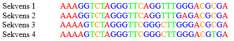
 </figure>

For disse fire sekvenser kan man tælle alle parvise forskelle. Dette er
gjort i den følgende tabel.

|         | Sekvens 1|Sekvens 2|Sekvens 3|Sekvens 4|
|---------| :-------:|:-------:|:-------:|:-------:|
|Sekvens 1|          |1        |3        |4        | 
|Sekvens 2|          |         |4        |5        | 
|Sekvens 3|          |         |         |1        |

Vi definerer ***nukleotiddiversiten π*** som sandsynligheden for, at to
tilfældigt udtrukne sekvenser fra populationen i en baseposition bærer
to forskellige baser. Den findes på en simpel måde. Man adderer alle
parvise sammenligninger og dividerer med antallet af sammenligninger (6
i vores tilfælde). Desuden divideres med sekvensen længde for at få en
værdi per base (30 i vores tilfælde). I ovenstående eksempel bliver det

*π* = (1 +3 + 4 +4 + 5 +1)/(6 × 30) = 0,10

Dette er ækvivalent med ***gendiversiten H***E  som er
sandsynligheden for, at to tilfældigt udtrukne gener fra populationen i
et locus bærer to forskellige alleler.

## Neutral teori for molekylær evolution

### Historisk baggrund

<figure>
  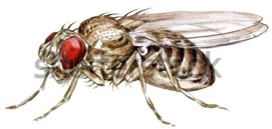
 </figure>

Før 1966 havde man ingen viden om omfanget af genetisk variation i naturlige
populationer. Harris (1966)[^1] og Hubby & Lewontin (1966)[^2]. Harris anvendte
enzymelektroforese til at finde genetisk variation i
isoenzymer hos mennesket, medens Lewontin & Hubby bestemte dette hos
bananfluen *Drosophila pseudoobscura*. Man fandt forbløffende høje
gendiversiteter *HE*; 0,12 hos *Drosophila* og 0,10 hos
mennesket. Lignende høje fund blev gjort for mange andre arter.

Fundet af den høje genetiske diversitet i naturlige populationer
medførte en diskussion af mekanismerne for opretholdelsen af den
observerede variation. Deltagerne kan groft opdeles i to lejre,
“***selektionisterne***” og “***neutralisterne***”. De førstnævnte
forklarer den høje variation med overdominans (det vil sige, at
heterozygoter har en større fitness end homozygoterne). Den anden lejr,
“neutralisterne”, mener at den observerede variation for den største del
i fitnessmæssig henseende er neutral, og at den opretholdes i en
ligevægt mellem genetisk drift og mutation. Drift medfører et tab af
genetisk materiale på grund af tilfældige fluktuationer, medens mutation
modvirker dette tab. Denne såkaldte neutrale teori blev fremsat af
Kimura (1968)[^3]. Han argumenterer mod “selektionisterne”, at den
postulerede opretholdelse gennem naturlig selektion medfører en så stor
selektiv byrde, at det vil være vanskeligt at forklare opretholdelsen
med en sådan mekanisme. Ud over at forklare den høje genetiske variation
har den neutrale teori en teoretisk forklaring på observerede
substitutionsrater i gener, der for manges vedkommende er konstante
igennem tiden.

De to skolers opfattelse af variation i naturlige populationer er
illustreret i den efterfølgende figur. Neutralisterne mener at de
forskelle, der kan ses i figuren til højre i virkeligheden med hensyn
til fitness kan illustreres som vist i figuren til venstre. Fitness for
de forskellige genotyper er den samme. En sjælden gang dukker der en
mutation op (*m*). Hvis den har dårligere fitness, vil den komme i en
mutations-selektions ligevægt. Har den en højere fitness, kan den
erstatte vildtypen og blive den nye vildtype. For en grundig gennemgang
af den neutrale teori bør man konsultere Kimura (1983)[^4] ), som nok har
ydet det største bidrag til teoriens udvikling.

<figure>
  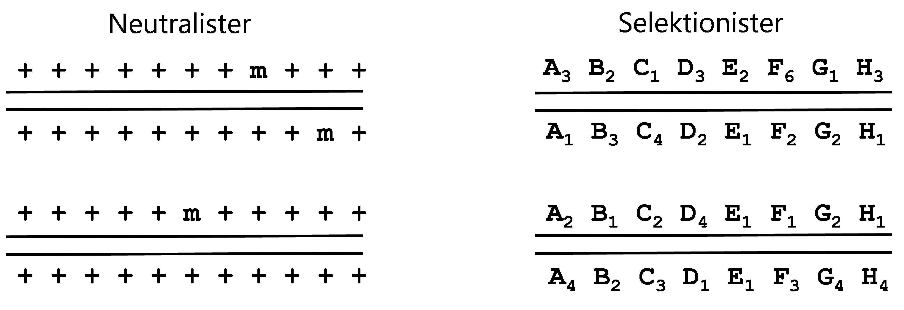
 </figure>

Kontroversen mellem selektionisterne og neutralisterne. Figuren viser et
sæt kromosomer for to individer. I figuren til venstre indikerer et +
vildtype allelen, medens et m indikerer en mutation. I figuren til højre
repræsenterer hvert bogstav et gen og tallene er forskellige alleler.
Bemærk forøvrigt, at genomet stort set kun består af kodende gener, der
sidder som en række perler på en snor.

### Forudsigelser af den neutrale teori

Den neutrale teori er baseret på to parametre, den ***neutrale
mutationsrate μ*** og ***populations­­størrelsen N***. Ved en ***effektiv
neutral mutation*** forstås en mutation, der har så lille en indflydelse
på bærerens fitness, at det er genetisk drift og ikke naturlig
selektion, som bestemmer dens frekvens i populationen. *Det er vigtigt
at pointere, at* *den neutrale mutationsrate kun udgør en lille brøkdel
af den totale mutationsrate*. *Vi gør det på den følgende måde. Ud af
den totale mutationsrate på ν er det kun brøkdelen k, der er effektivt
neutral, hvilket resulterer i en neutral mutationsrate på*

*µ = kν*

Brøkdelen *k* kan variere mellem forskellige dele af genomet og for
forskellige områder af proteinkodende gener: på kodonposition 1, 2 og 3
f.eks. eller for områder med forskellige selektive begrænsninger. De
fleste mutationer vil være skadelige, og meget få vil have en positiv
effekt på fitness i proteinkodende gener. De skadelige mutationer
fjernes gennem ***negativ selektion***, medens mutationer, der har en
positiv effekt, er under ***positiv selektion**.* Definitionen af
***effektiv neutral mutation*** indebærer at der godt kan være
fitnessforskelle mellem mutationer. Den fokuser på, at det er drift, der
spiller den afgørende rolle. Derfor kan en mutation, der påvirker dens
bærers fitness med en given selektionskoefficient *s* i en stor
population være under indflydelse af naturlig selektion, men i en
tilstrækkelig lille population vil det være genetisk drift, der
bestemmer dens hyppighed i populationen. Samspillet mellem genetisk
drift og naturlig selektion er afhængig af produktet 2*Ns*, hvor *s* er
selektionskoefficienten hos den nye mutant. Den kan være positiv eller
negativ. Hvis 2*Ns* \>\> 1, er det naturlig selektion, der bestemmer
udfaldet. I tilfældet hvor 2*Ns* \<\< 1, er det genetisk drift, der
bestemmer udfaldet. Nye mutationer i en population har jo en hyppighed
på 1/(2*N*). For dem kan det vises, at deres sandsynlighed for at blive
fikseret i populationen er givet ved

|    Selektionkoefficient|       Selektion | *p*(fiksering af ny allel)|
| :---------------------:| :-------------: | :------------------------:|
|    *s* ≈ 0             |       Neutral   | 1/(2*N*)                  |
|    *s* < 0             |       Negativ   | < 1/(2*N*)                |
|    *s* > 0             |       Positiv   | 2*s*                      |

Det overraskende er, at selv for positiv selektion kun vil være en
brøkdel af nye mutationer, der bliver fikseret i populationen. Langt de
fleste tabes på grund af genetisk drift hurtigt efter, at de er blevet
introduceret i populationen.

Kimura’s simple argument for den neutrale teori baserer sig på, at der
opstår en ***ligevægt mellem genetisk drift og neutral mutation***, hvor
heterozygotien i et givet locus vil være konstant. Det er vigtigt at
huske på, at ligevægten er dynamisk. Det er niveauet af heterozygoti,
der er konstant; men der vil løbende ske en substitution med nye
alleler. Genetisk drift fjerner variation med en rate på 1/(2*N*), og
mutation producerer ny variation med den ***neutrale mutationsrate μ***.
Når der opstår en mutation i en population, antages den at være ny, det
vil sige, at hver mutation resulterer i en allel, der ikke har været
observeret før. Dette er den ***uendelige allel model* (*infinite allele
model*)**. Kimura fokuserede på variation i proteiner, der ofte kan
bestå af et par hundrede aminosyrer. Når der sker en mutation, er det
usandsynligt, at den rammer samme aminosyre – og hvis det sker, så er
der jo 20 at vælge imellem[^5].

Når en mutation er blevet fikseret i en population, taler vi om, at der
er sket en ***substitution***. Vi skal nu se nærmere på samspillet
mellem genetisk drift og neutral mutation, hvor vi fokuserer på
***substitutionsraten***, dvs. den rate hvormed nye mutationer fikseres
i en population. I en diploid population af størrelsen *N* vil der i
hver generation introduceres 2*Nμ* nye neutrale mutationer. En ny
mutation optræder som én enkel ny allel, der har hyppigheden 1/(2*N*).
Derfor kan substitutionsraten bestemmes som produktet af raten, hvormed
nye neutrale mutationer introduceres, med sandsynligheden for at de
fikseres. Dette bliver så

$$
2N\mu \times 1/(2N) =\mu
$$

Vi ser derfor, at ***substitutionsraten*** ***hvormed nye neutrale
mutationer opstår per generation og som vil blive fikseret, er lig med
den neutrale mutationsrate og*** ***er*** ***uafhængig af
populationsstørrelsen***. Vi får derfor en substitution i gennemsnit for
hver 1/*μ*’te generation. Den neutrale teori forudsiger dermed et
***molekylært ur, der tikker med en*** ***konstant rate per
generation***. Bemærk, der findes intet generelt molekylært ur.
Forskellige gener eller områder af gener kan have forskellige rater,
afhængig af de selektive begrænsninger, der forefindes.

Man kan vise, at en substitution i gennemsnit har været 4*N*
generationer i populationen, før den er blevet fikseret. Dette
tydeliggør, at den genetiske diversitet, der findes i en population, er
en funktion af populationens størrelse. I små populationer er tiden for
en fiksering mindre end i store populationer. Der må derfor være færre
mutationer undervejs til fiksering i små populationer end i store
populationer. Man kan vise at ***heterozygotien***
(***gendiversiteten***) ***HE*** ***i ligevægt mellem
genetisk drift og neutral mutation er givet ved***

$$
H_E = \frac{4N\mu}{1 + 4N\mu}.
$$

Bemærk, at det er produktet 4*Nμ*, der bestemmer graden af
gendiversiteten. ***Den neutrale teori forudsiger dermed også niveauet
af variation i en population.*** I figuren nedenunder er dette
illustreret ved den lodrette grønne linje. Ligevægten er ikke statisk
men dynamisk. Der kommer hele tiden nye mutationer, som fjernes gennem
genetisk drift. Det er gendiversitetens niveau, der er i ligevægt.

<figure>
  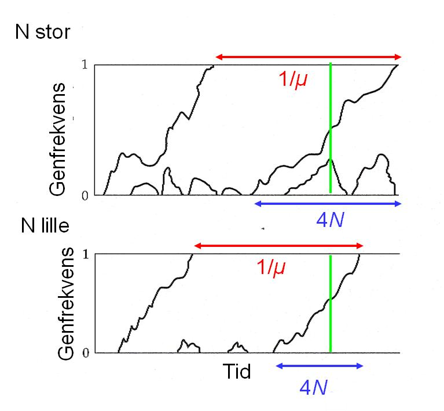
 </figure>

Figuren til højre illustrerer den neutrale teori. Den viser evolutionen
i henholdsvis en stor og en lille population. Bemærk, at de fleste nye
mutationer kun findes i populationen i kort tid. Substitutionsraten er
konstant og er uafhængig af populationsstørrelsen. Vi forventer derfor
en substitution i gennemsnit for hver 1/*μ*’te generation. Som nævnt, så
har en substitution været 4*N* generationer undervejs, før den bliver
fikseret. Det tager derfor kortere tid i en lille population end i en
stor population.

##  Den genetiske kode

<figure>
  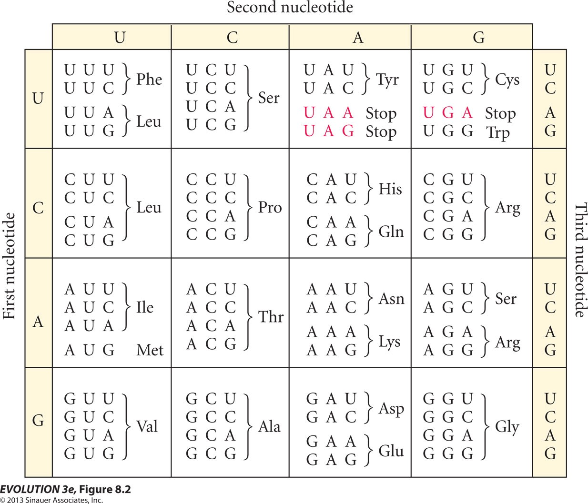
 </figure>

# Molekylær evolution opgaver

## Formål

Disse øvelser har deres fokus på at få viden om og praktisk kendskab
til:

- Positiv/negativ selektion
- Forskelle i substitutionsrater mellem regioner i gener
- Neutral teori
- Genetisk diversitet (*H**E*  og *π*
- Selektive “sweeps”

### Opgave 1

Basesubstitutioner kan inddeles i synonyme og ikke-synonyme, afhængig af
om de medfører en aminosyreudskiftning eller ej. Når man skal beregne
raten af synonyme (*dS*) og ikke-synonyme substitutioner (*dN*) skal
substitutionerne beregnes per henholdsvis synonyme og ikke-synonyme
sites i de involverede sekvenser. Størrelsen af ω (= *dN*/*dS*) siger
noget om hvilke former for selektion, der har virket på en
proteinsekvens. (*dN* og *dS* betegnes nogle gange *Ka* og
*Ks*.)

1)  Hvilken form for selektion på proteinet er mest sandsynlig at have
    virket på et protein hvis ω \> 1.

Klik for at se svaret.

Positiv selektion

Nedenfor ses en alignment mellem homologe sekvenser fra mus og menneske,
som koder for en lille del af proteinet CCR1 (Chemokine (C-C motif)
receptor 1). Dette protein er en del af immunforsvaret.

<figure>
  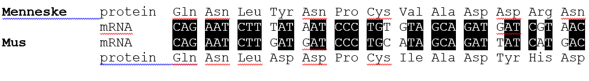
 </figure>

De 39 baser, der indgår i sekvensen, kan inddeles i 8 synonyme og 31
ikke-synonyme sites. (Det er ikke umiddelbart nemt at tælle disse op.)

2)  Hvor mange synonyme og ikke-synonyme substitutioner er der mellem
    menneske og mus?

Klik for at se svaret.

1 og 6.

3)  Hvor stor er *dN* og *dS*?

Klik for at se svaret.

 *dS* = 1/8 = 0,125
 
 *dN* = 6/31 = 0,194

4)  Beregn ω for den ovenstående alignment.

Klik for at se svaret.

ω = 0,194/0,125 = 1,6.

Den beregnede ω værdi er karakteristisk for hele CCR1s protein kodende
sekvens.

5)  Diskuter den beregnede ω værdi for CCR1 i lyset af CCR1s funktion.

Klik for at se svaret.

Immunforsvarets gener er ofte under positiv selektion pga.
interaktioner med f.eks. vira og parasitter.

**Opgave 2**

Nedenstående figur viser en del af histon H4 genet hos mennesket og
hvede – opdelt i kodons. Sekvensen fra mennesket er vist helt, mens
sekvensen for hvede kun er vist med baser, der er forskellige fra
menneskets sekvens. Et punktum i sekvensen betyder, at basen er ens med
den øverste sekvens.

<figure>
  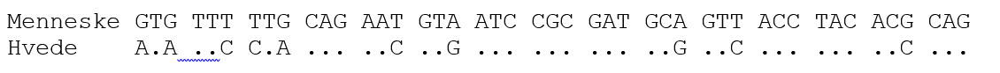
 </figure>

1)  Hvor mange substitutioner er der på position 1, 2 og 3 i de
    afbildede kodons?

Klik for at se svaret.

- Position 1: 2
- Position 2: 0
- Position 3: 8

2)  Hvorfor er der generelt forskel på substitutionsraten på de
    forskellige kodonpositioner?

Klik for at se svaret.

Forskel i selektive begrænsninger i de tre positioner. Udskiftning i
3. position medfører sjældent aminosyreudskiftning, medens udskiftning
i position 1 oftest medfører udskiftning og udskiftning i position 2
altid medfører aminosyreudskiftning.

3)  Hvordan forholder det sig med substitutionsrater i introns i forhold
    til exons? Er de højere eller lavere end i exons?

Klik for at se svaret.

Højere i introns p.g.a. mindre selektive begrænsninger. Se figur
i svaret til spørgsmål 4.

4)  Har pseudogener højere eller lavere substitutionsrater end exons og
    introns?

Klik for at se svaret.

Højere, p.g.a. mindre selektive begrænsninger. Se den følgende figur.

<figure>
  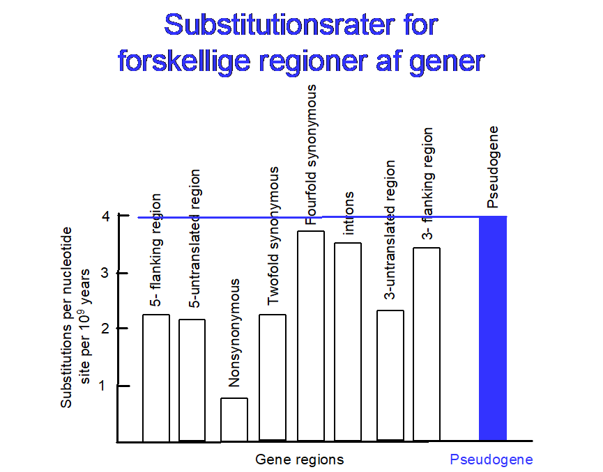
 </figure>

5)  Hvilken af de tre nævnte kategorier (exons, introns, pseudogener)
    afspejler den totale mutationsrate?

Klik for at se svaret.

Pseudogener.

**Opgave 3**

Den neutrale teori giver en forklaring på substitutionsraten i gener og
på forekomsten af genetisk diversitet. Teorien er baseret på 2
parametre, den *neutrale mutationsrate*, *μ*, og
*populationsstørrelsen*, *N.* Den neutrale mutationsrate måles i
mutationer per base per år.

Vi antager, at vi kan bruge *uendelig site* modellen, dvs. at der ikke
optræder to mutationer på samme position i en given nukleotidsekvens.
Antag at *μ* = 10-9/base/år. Betragt sekvenser fra to
beslægtede arter, der er splittet fra hinanden for 4 × 106 år
siden. Sekvenserne er 10000 basepar lange.

1)  Hvor mange baser forventes at være forskellige mellem de to
    sekvenser?

Klik for at se svaret.

*D* = 2 × *μ* × *t* × L = 2 × 10-9 × 4 × 106 ×
10000 = 80

To-tallet stammer fra, at der sker substitutioner i hver af grenene.

2)  Hvordan forventes antallet af forskelle at ændre sig som funktion af
    tiden?

Klik for at se svaret.

Lineært

Den virkelige verden opfører sig ikke altid så simpelt som den uendelige
site model.

3)  Afspejler antallet af forskelle mellem to sekvenser antallet af
    mutationer, der er sket i deres evolutionære historie?

Klik for at se svaret.

Nej. Multiple mutationer i samme baseposition resulterer i et
underestimat af antallet af mutationer, der er sket.

4)  Hvordan ser antallet af forskelle mellem to sekvenser ud som
    funktion af tiden? Illustreres med en skitse.

Klik for at se svaret.

<figure>
  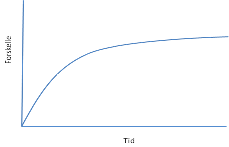
 </figure>

5)  Vil en ny mutation, der påvirker fitness negativt i forhold til den
    allerede forekommende variation, altid blive elimineret gennem
    naturlig selektion?

Klik for at se svaret.

Nej. Hvis populationsstørrelsen er tilstrækkelig lille kan genetisk
drift “overdøve” naturlig selektion og fiksere en skadelig allel.

6)  Vil en ny mutation *a*, der påvirker fitness positivt i forhold til
    den allerede forekommende variation, altid blive fikseret gennem
    naturlig selektion?

Klik for at se svaret.

Nej, i tråd med forrige spørgsmål, så kan genetisk drift i
tilstrækkelig små populationer “overdøve” naturlig selektion og
eliminere en allel, der påvirker fitness positivt hos dens bærer.

Antag, at fitness for bærere af den positive mutation kan beskrives ved

|  *AA*     | *Aa*   | *aa*    |
| ----------| :-----:| :------:|
|  1        | 1 + *s*| 1 + 2*s*| 

1)  Hvad er sandsynligheden for at blive fikseret for sådan en mutation?

Klik for at se svaret.

Sandsynligheden er givet ved 2*s.* D.v.s., at kun en lille brøkdel af
positive mutationer fikseres gennem naturlig selektion.

### Opgave 4
<figure>
  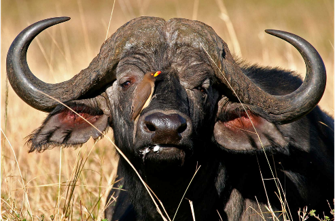
 </figure>

I en undersøgelse over populationsstrukturen af den afrikanske bøffel
(*Syncerus caffer*) i Kenya og Uganda estimerede Heller et
al. [^6] den genetiske diversitet i ti nationalparker. De beregnede den
forventede gennemsnitlige gendiversitet, *HE*, på baggrund af
allel­frekvenserne i 17 mikrosatellit loci i de ti stikprøver. Som det
ses fra figuren længere nede, så ligger *HE* mellem 0,75 og
0,82. I en tidligere undersøgelse over genetisk diversitet i den
afrikanske bøffel fandt Grobler og van der Bank (1996)[^7] en
*HE* mellem 0,027 til 0,029 i sydafrikanske bøfler. De
undersøgte variationen i 33 enzymloci ved hjælp af enzymelektroforese.

1)  Hvorfor er der så stor forskel i *HE* mellem variation
    fundet hos mikrosatellitter og hos emzymloci? (Mutationsraten for
    mikrosatellitter er cirka 100 gange højere end for enzymloci.)

<figure>
  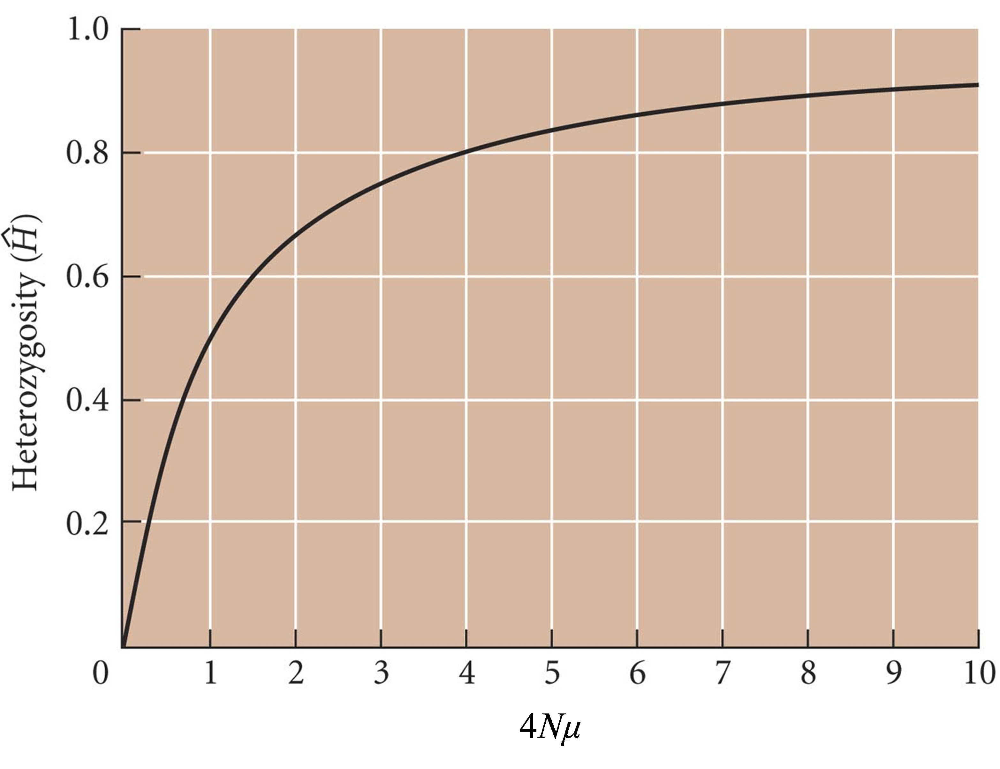
 </figure>
 Tag udgangspunkt i den uendelige allel model, hvor gendiversiteten i
ligevægt er givet ved

$$
H_E  = \frac{4N\mu}{1 + 4N\mu}
$$

Dette er illustreret i figuren. Vink: start med at finde 4*Nμ*
for mikrosatellitter og sammenhold så med, om en 100 gange mindre værdi
kan forklare værdien for enzymloci ved at indsætte det i formlen
foroven.

Klik for at se svaret.

Vi forventer en ligevægt mellem genetisk drift og mutation. Ligevægten
vil være afhængig af mutationsraten – jo højere, des mere diversitet.
Som nævnt, så er ***mutationsraten*** betydeligt højere for
mikrosatellitter (10-4 – 10-3 per generation)
end for enzymloci, hvor mutationsraten er 10-6 –
10-5 per generation. Vi forventer derfor en betydelig
højere diversitet for mikrosattelliter end for enzymloci.
Vi ser, at *HE* for mikrosatellitter er cirka 0.8, hvilket
svarer til 4*Nμ* = 4. En 100 gange lavere værdi for enzymloci giver
*HE *= 0.04/(1 + 0.04) = 0.038. Dette er ikke så langt fra
den observerede værdi.

I figuren nedenfor er den gennemsnitlige gendiversitet, *HE*,
afbildet som funktion af logaritmen af nationalparkens størrelse (i
km2).
<figure>
  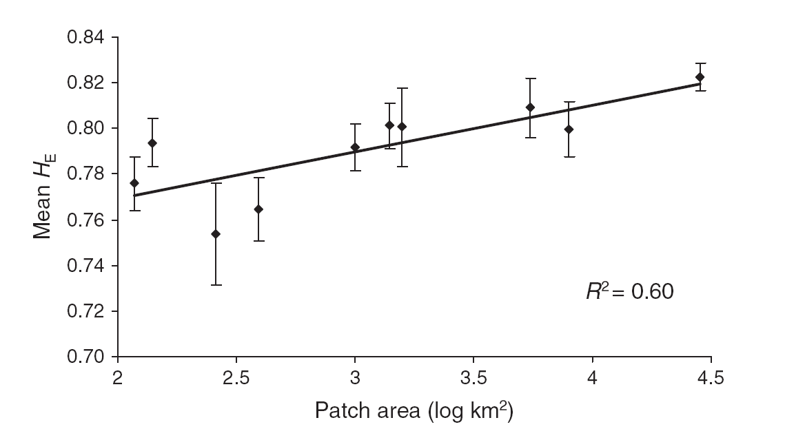
 </figure>

2)  Hvad er årsagen til, at nationalparken størrelse synes at have en
    indflydelse på mængden af genetik diversitet, der findes i den?

Klik for at se svaret.

Vi forventer, at nationalparkens størrelse afspejler bærekapaciteten for
bøfler. Figuren viser derfor en positiv sammenhæng mellem bøflernes
populationsstørrelse og deres gendiversitet. Dette er forventet, da
genetisk drift spiller en mindre rolle jo større populationen er. Her er
tabet gennem genetisk drift, 1/(2*N*) per generation, mindre

### Opgave 5

Malariaparasitten *Plasmodium falciparum* bærer en allel i
dihydrofolatreduktase (dhfr)-genet, som gør den resistent over for
antimalaria-medikamentet “Fansidar”. Resistensen spredtes hurtigt i
Sydøstasien, da lægemidlet blev introduceret i midten af ​​1970’erne.
Resistensen blev fikseret på cirka 6 år. I figuren nedenunder afbildes
gendiversiteten for 35 mikrosatellitter, som er placeret på samme
kromosom, som dhfr-genet sidder på. (Se bort fra den stiplede og den
fuldt optrukne kurve.) Pilen angiver positionen af genet på kromosomet.
<figure>
  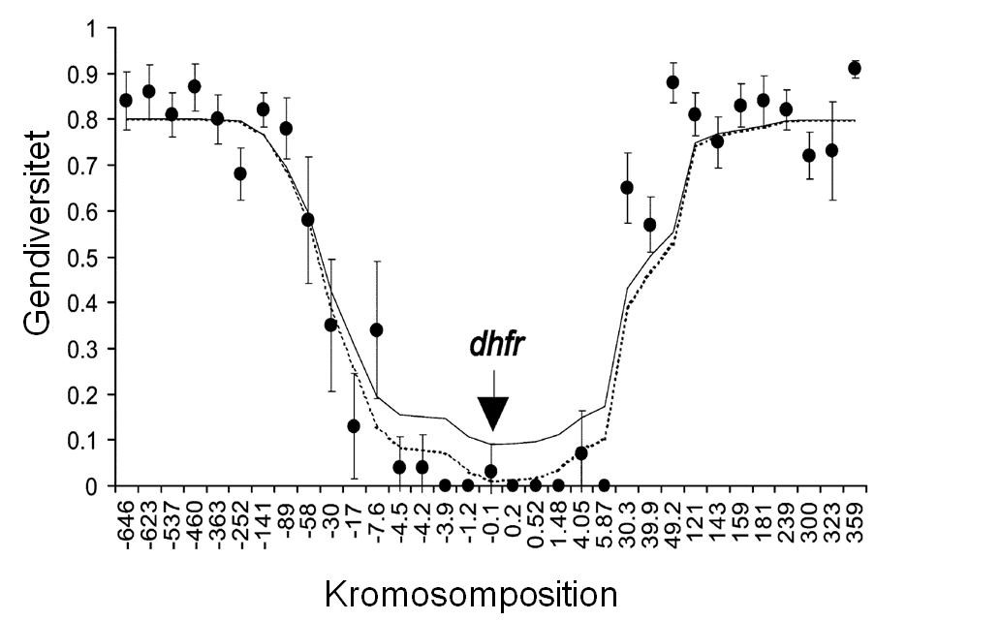
 </figure>

1)  Hvorfor har mikrosatellitterne, der er placeret tæt ved dhfr-genet,
    en gendiversitet på 0?

Klik for at se svaret.

Der har været et stærkt “selective sweep”, der har fikseret den
resistente allel i populationen. Tæt koblede gener er derfor blevet
fikseret for den allel, der fandtes sammen med sammen med den
resistente allel.

<figure>
  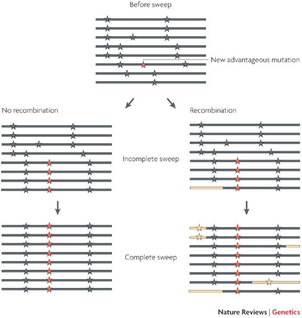
 </figure>

2)  Kan man ud fra fordelingen af gendiversiteten langs med kromosomet
    konkludere, om parasitten har en klonal eller en seksuel formering?

Klik for at se svaret.

Ja, hvis den havde haft en klonal formering, så ville hele kromosomet
være blevet fikseret. Den må have haft en seksuel forplantning, hvor
der sker rekombination under meiosen. Jo større afstanden til
dhfr-genet er, des flere rekombinationer sker der, og lociene vil så i
mindre grad blive påvirket af et selective sweep.

**Opgave 6**
<figure>
  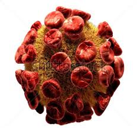
 </figure>

HIV virus kan nu til dags behandles med en række forskellige medikamenter,
der er i stand til at holde virus populationen i en patient nede på et
niveau, hvor patienten ikke bliver syg. Det sker ofte, at HIV virus
udvikler resistens overfor et bestemt medikament. Den har en meget høj
mutationsrate. Nedenstående figur illustrerer evolutionen i virus
populationen i en enkelt patient over tid. Hver række i figuren viser
sekvensen af polymorfe sites i en enkelt virus sekvens af patienten.
(Positionerne findes nederst i figuren.) De øverste 8 viser sekvenser,
der blev taget fra patientens blod før medikamentet blev givet til
patienten, medens de nederste 6 sekvensen viser sekvenser på dag 84
efter behandlingen med medikamentet blev påbegyndt. Desuden vises codon
103 (baseposition 307-309). AAA og AAG koder for lysin, medens AAT koder
for asparagin. Asparagin i codon 103 medfører resistens overfor det nye
medikament. Sorte og orange firkanter angiver henholdsvis synonyme og
ikke-synonyme mutationer i forhold til vildtypen.
<figure>
  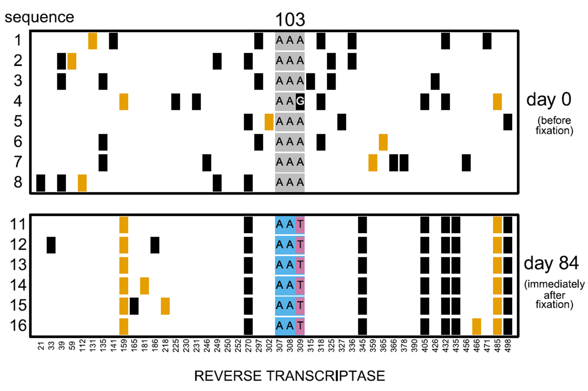
 </figure>

1)  Hvor mange synonyme og ikke synonyme polymorfe sites findes i den
    øverste figur (sekvens 1 til 8). Man skal ikke tælle antallet af
    mutationer, men antallet af **sites**. Husk at tælle position 309
    med.

Klik for at se svaret.

Synonyme: 24
Ikke-synonyme: 8

2)  Hvilken form for naturlig selektion synes at have foregået før dag
    0, når man fokuserer på forekomsten af synonyme og ikke-synonyme
    sites på dette tidspunkt?

Klik for at se svaret.

Negativ selektion, der fjerner skadelige mutationer.

3)  Hvilken evolutionær proces illustreres med figuren? (Når man
    sammenligner dag 0 og dag 84.)

Klik for at se svaret.

Selective sweep

4)  Beskriv ***kort*** hvad der sker under denne proces.

Klik for at se svaret.

Der er sket en mutation i codon 103 (en transversion af A til T), som
så er blevet fikseret i viruspopulationen. Naturlig selektion har
fikseret den resistente mutation.

5)  Hvordan ændres nukleotiddiversiteten sig under denne proces?

Klik for at se svaret.

Den aftager på grund af hitchhiking, da andre sites koblet til det
selekterede locus også bliver fikseret. Kan ses på figuren. Den
nederste figur indeholder næsten ingen polymorfe sites.

6)  Hvordan påvirkes LD (linkage disequilibrium, koblingsuligevægt)
    under denne proces?

Klik for at se svaret.

LD stiger.

7)  Hvorfor findes der polymorfe sites i den nederste figur? Hvor kommer
    de fra?

Klik for at se svaret.

Det er formentlig nye mutationer, der er blevet introduceret i
populationen.

8)  Hvad er antallet af synonyme og ikke synonyme polymorfe sites, som
    findes i den nederste figur (sekvens 11 til 16)?

Klik for at se svaret.

Synonyme: 3
Ikke-synonyme: 3

9)  Hvorfor er forholdet nu anderledes end det, som fundet i spørgsmål
    a?

Klik for at se svaret.

Der er forholdsvis flere ikke-synonyme polymorfier, som negativ
naturlig selektion ikke har fjernet endnu.

### Opgave 7
<figure>
  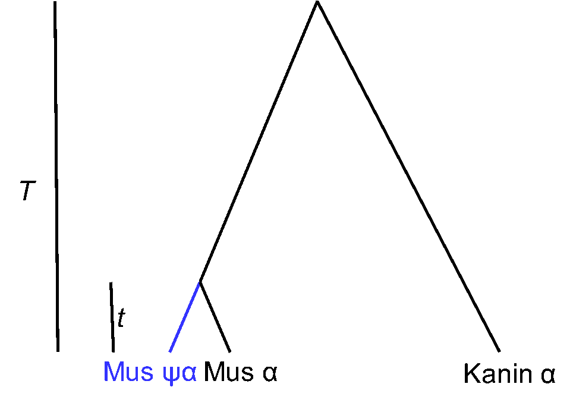
 </figure>

Efter en genduplikation kan den ene kopi miste sin funktion og blive til et pseudogen. Det er sket for hemoglobin α genet hos husmusen. Figuren
viser en fylogeni over musens og kaninens hemglobin α, samt musens
pseudogen hemoglobin ψα. Det antages, at kaninen og musen havde en
fælles forfader for *T* år siden. Pseudogenet og genet for hemoglobin α
splittedes for *t* år siden.

Vi tager udgangspunkt i den uendelige site model, der antager at der
ikke sker mutationer flere gange i det samme site i en gren. Vi går ud
fra, at mutationsraten er ν per base per år i dette proteinkodende gen.
Vi antager desuden, at de selektive begrænsninger er forskellige i koden
1, 2 og 3. Disse betegnes henholdsvis *k*1 *k*2 og
*k*3. Hermed menes den brøkdel af mutationer, der er
fitnessmæssig neutrale. Vi får så, at raterne for neutrale mutationer på
de tre kodonpostioner bliver

µ1 = *k*1 × ν

µ2 = *k*2 × ν

µ3 = *k*3 × ν.

Vi antager, at pseudogener ikke har disse selektive begrænsninger. Med
udgangspunkt i fylogenien over hemoglobin genet skal de følgende
spørgsmål besvares. (Vi fokuserer på de tre kodonpositioner, og tager
ikke hensyn til genets længde *L*.)

1)  Hvor mange substitutioner forventes på de tre kodonpostioner mellem
    musens og kaninens gener? (Udtrykkes som funktion af *µ*i
    og *T*.)

Klik for at se svaret.

*d*1 = µ1 × 2*T*

*d*2 = µ2 × 2*T*

*d*3 = µ3 × 2*T*

2)  Hvor mange substitutioner forventes på de tre kodonpostioner mellem
    musens hemoglobin gen og musens pseudohemoglobin gen?

Klik for at se svaret.

*d*1 = (µ1 + ν) × *t*

*d*2 = (µ2 + ν) × *t*

*d*3 = (µ3 + ν) × *t*

Raterne i de to grene er forskellige. Den ene har selektive
begrænsninger mod mutationer, medens den anden gren ikke har det.

[^1]: Harris, H. 1966. Enzyme polymorphism in man. *Proceedings of the Royal Society of London, Series B* **164**: 298–310.

[^2]: Hubby, J. L. & R. C. Lewontin 1966. A molecular approach to the study of genic heterozygosity in natural populations. I. The numbers of alleles at different loci in *Drosophila pseudoobscura*. *Genetics* **54**: 577–594.

[^3]: Kimura, M. 1968. Evolutionary rates at the molecular level. *Nature* **217** 624–626

[^4]: Kimura, M. 1983. *The Neutral Theory of Molecular Evolution*. Cambridge University Press, Cambridge.

[^5]: Så simpelt er det dog ikke! En enkelt baseudskiftning i den genetiske kode vil kun kunne ende i et begrænset antal nye aminosyrer.

[^6]: Heller, R., J.B.A. Okello & H.R. Siegismund 2010. Can small wildlife conservancies maintain genetically stable populations of large mammals? Evidence for increased genetic drift in geographically restricted populations of Cape buffalo in East Africa. *Molecular Ecology* **19**: 1324–1334.

[^7]: Grobler, J.P. & van der Bank, F.H. 1996. Genetic diversity, gene     flow and the effect of isolation in African buffalo (*Syncerus caffer*). *Biochemical Systematics and Ecology* **24**: 757–762.
